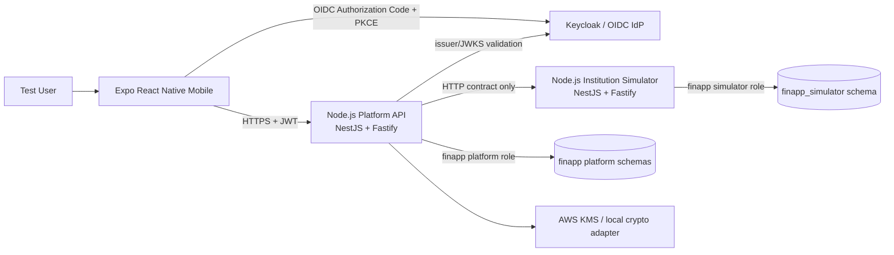
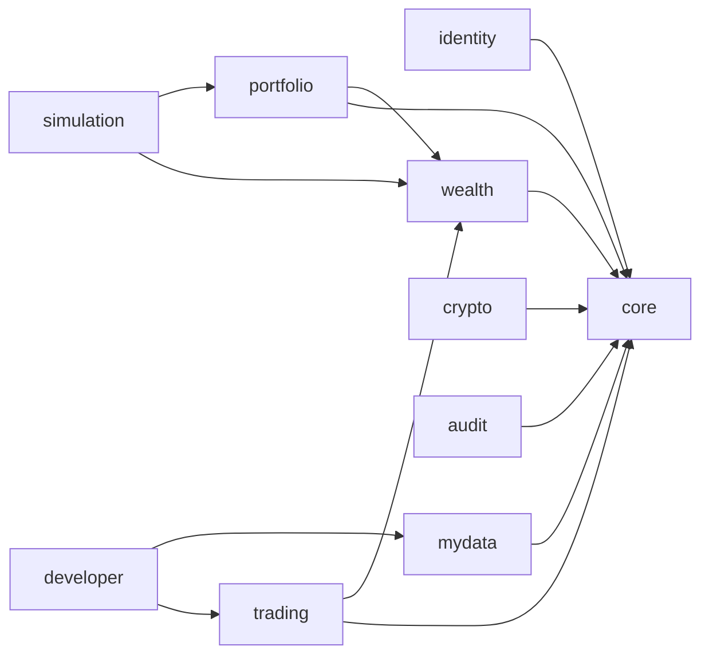

# 권장 애플리케이션 아키텍처 및 품질 규칙

- 상태: 실행 기준선
- 작성일: 2026-09-01
- 적용 대상: `apps/mobile`, `services/platform-api`, `services/institution-simulator`
- 관련 결정: `ADR-0001`, `D-001`~`D-003`, `D-028`~`D-038`

## 1. 목적과 강제 수준

이 문서는 모바일 앱과 Node.js 서버의 구조가 기능 추가 과정에서 무너지지 않도록 구현 경계, 의존성 방향, 상태 소유권과 자동 검증 기준을 정의한다. 새 코드는 이 문서를 기본값으로 따르며 예외는 같은 commit에서 ADR 또는 `IMPLEMENTATION_DECISIONS.md`에 이유와 종료 조건을 기록해야 한다.

규칙의 강제 수준은 다음과 같다.

- `MUST`: 위반한 상태로 milestone을 완료하거나 정상 commit하지 않는다.
- `SHOULD`: 특별한 이유가 없으면 따른다. 예외는 개발 로그에 근거를 남긴다.
- `MAY`: 복잡성이 실제로 발생했을 때 선택적으로 적용한다.

핵심 원칙:

1. 배포 경계는 신뢰 경계와 데이터 소유권을 따른다.
2. 각 배포 단위 내부는 기술 계층보다 업무 기능을 먼저 드러낸다.
3. 외부 시스템, NestJS, Fastify와 PostgreSQL 접근 코드는 도메인 규칙 바깥에 둔다.
4. 서버 상태와 클라이언트 상태를 구분하며 동일 데이터를 여러 저장소에 복제하지 않는다.
5. 아키텍처 규칙은 문서로만 선언하지 않고 CI에서 자동 검증한다.
6. 처음부터 모든 추상화를 만들지 않되, 나중에 바꾸기 어려운 경계는 기능 개발 전에 고정한다.

## 2. 확정 기술과 아키텍처 요약

| 영역 | 채택 기술/패턴 | 적용 방식 |
|---|---|---|
| Backend runtime | Node.js 24 LTS + TypeScript strict | mobile과 동일 언어 생태계, npm workspaces |
| HTTP framework | NestJS 12 + Fastify adapter | Nest module/DI 구조와 Fastify HTTP runtime 결합 |
| Platform API | 모듈형 모놀리스 | feature module, 명시적 export, package-by-feature |
| Simulator | 독립 NestJS service | platform과 코드·DB role·migration을 공유하지 않음 |
| 서버 모듈 내부 | 실용적 ports/adapters | `api → application → domain`, infrastructure는 port 구현 |
| Database | PostgreSQL + Drizzle ORM/Kit | TypeScript schema, 검토된 SQL migration, 명시적 transaction |
| Backend test | Vitest + Nest testing + Testcontainers | unit, module integration, HTTP E2E, PostgreSQL concurrency |
| 모바일 | feature-first + route adapter | Expo Router route는 조합만 담당하고 기능 코드는 `features`에 배치 |
| 모바일 상태 | 상태 소유권 분리 | TanStack Query=서버 상태, Zustand=소량의 client-only 상태 |
| 품질 통제 | architecture fitness function | Nest exports, dependency-cruiser, ESLint, typecheck와 테스트 |

NestJS를 application framework로 사용하고 bootstrap에서 `@nestjs/platform-fastify`의 `FastifyAdapter`를 명시한다. 별도의 bare Fastify 서비스를 만들거나 같은 서비스에서 Express와 Fastify를 혼용하지 않는다.

## 3. 전체 시스템 경계



### 3.1 반드시 유지할 경계

- `platform-api`와 `institution-simulator`는 별도 process와 container로 실행한다.
- 두 서비스는 domain type, Drizzle schema, repository 구현과 migration을 공유하지 않는다.
- platform은 simulator의 DB나 repository를 직접 조회하지 않고 HTTP 계약만 사용한다.
- 각 서비스는 전용 DB login role과 `finapp_` prefix가 붙은 전용 schema를 사용한다.
- 모바일은 DB 또는 simulator에 직접 연결하지 않고 platform API만 호출한다.
- 인증은 OIDC IdP가 담당하며 platform은 resource server 역할로 token을 검증한다.

### 3.2 마이크로서비스를 추가하지 않는 이유

MVP의 팀 규모와 배포 복잡도에서는 기능별 마이크로서비스보다 모듈형 모놀리스가 변경 원자성, 로컬 재현성과 데이터 정합성을 유지하기 쉽다. 모듈 경계와 데이터 소유권은 향후 분리 가능하도록 설계하지만 실제 분산 배포는 독립 확장, 장애 격리 또는 조직 소유권 요구가 측정된 뒤 ADR로 결정한다.

## 4. Backend workspace와 실행 구조

```text
FinancialApp/
├── apps/
│   └── mobile/
├── services/
│   ├── platform-api/
│   └── institution-simulator/
├── infra/
├── package.json                  # npm workspaces와 공통 명령
├── package-lock.json
└── tsconfig.base.json            # backend 공통 compiler baseline
```

- 두 backend 서비스는 npm workspace로 dependency version, lint와 build 설정을 공유한다.
- production 업무 코드는 workspace package로 공유하지 않는다.
- 공유 가능 범위는 ESLint/TypeScript/Vitest 설정과 순수 HTTP 계약 생성물이다.
- OpenAPI generated type을 공유할 때도 각 서비스 내부 domain type으로 변환한다.
- Node.js는 현재 LTS인 24 major를 `.nvmrc`, `engines`, CI와 container에 고정한다.
- TypeScript는 `strict`, `noUncheckedIndexedAccess`, `exactOptionalPropertyTypes`를 활성화한다. 호환성 문제가 확인되면 개별 option 완화 근거를 결정 문서에 남긴다.

### 4.1 병렬 delivery 경계

- frontend와 backend Codex session은 `PARALLEL_DEVELOPMENT_GUIDE.md`에 따라 별도 worktree와 branch에서 실행한다.
- frontend는 `apps/mobile`, backend는 `services`, `infra`, OpenAPI와 migration을 주로 소유한다.
- 두 영역의 결합점은 canonical OpenAPI revision이며 frontend mock과 실제 backend가 같은 계약 검증을 통과해야 한다.
- shared root config, lockfile, 공통 결정 문서와 main merge는 integration owner 한 명이 직렬 처리한다.
- 병렬 branch에서 각각 성공했어도 main 통합 상태의 전체 gate가 실패하면 완료가 아니다.

## 5. Platform API 아키텍처

### 5.1 NestJS feature module 기반 모듈형 모놀리스

```text
services/platform-api/src/
├── main.ts
├── app.module.ts
├── core/                         # config, logging, DB connection 같은 기술 기반
└── modules/
    ├── identity/
    ├── mydata/
    ├── wealth/
    ├── portfolio/
    ├── simulation/
    ├── trading/
    ├── crypto/
    ├── audit/
    └── developer/
```

다음 규칙은 `MUST`다.

- 업무 기능 하나를 NestJS feature module 하나로 표현한다.
- 다른 module에서 사용할 provider만 `exports`에 명시한다.
- 다른 module의 내부 파일을 deep import하지 않고 공개 `index.ts`와 exported injection token만 사용한다.
- module dependency graph는 단방향이며 cycle이 없어야 한다.
- `@Global()`은 config, logger와 request context처럼 검토된 기술 기반에만 제한한다. 업무 module에는 사용하지 않는다.
- `core`는 업무 module을 의존하지 않으며 범용 유틸리티 투기장이 되어서는 안 된다.
- `integration` 같은 전역 dumping folder를 만들지 않는다. 기관 연동은 `mydata/infrastructure`, 주문 연동은 `trading/infrastructure`처럼 소유 feature에 둔다.
- audit처럼 여러 module의 결과를 소비하는 기능은 domain/application event를 구독하고 업무 module이 audit 구현에 역으로 의존하지 않게 한다.

초기 허용 의존성 방향:



`identity`의 persistence row를 다른 module이 참조하지 않는다. 인증된 사용자 식별자는 auth guard가 제공하는 안정적인 application user ID 값으로 전달한다. 위 그래프와 다른 직접 의존성이 필요하면 공개 port를 먼저 정의하고 cycle 여부를 검증한다.

### 5.2 Feature 내부의 실용적 ports/adapters

복잡한 feature는 다음 구조를 사용한다.

```text
modules/trading/
├── trading.module.ts
├── index.ts                      # 다른 module에 공개할 symbol만 export
├── public/
│   ├── trading.facade.ts
│   └── order-status-changed.event.ts
├── api/
│   ├── order.controller.ts
│   ├── order-request.dto.ts
│   └── order-response.dto.ts
├── application/
│   ├── place-order.use-case.ts
│   ├── reconcile-order.use-case.ts
│   └── ports/
│       ├── order-repository.port.ts
│       ├── broker-gateway.port.ts
│       └── id-generator.port.ts
├── domain/
│   ├── order.ts
│   ├── order-status.ts
│   └── money.ts
└── infrastructure/
    ├── persistence/
    ├── broker/
    ├── scheduling/
    └── trading.providers.ts
```

의존성 방향:

```text
api ────────> application ────────> domain
infrastructure ─────────> application/domain
module composition ───────────────> api/application/infrastructure
```

- `api`는 transport 변환과 validation 후 application use case를 호출한다.
- `application`은 use case, transaction orchestration과 port를 소유한다.
- `domain`은 상태 전이, 금액 계산과 불변조건을 소유하는 순수 TypeScript다.
- `infrastructure`는 Drizzle/PostgreSQL, HTTP, KMS와 scheduler adapter를 구현한다.
- `*.module.ts`는 provider wiring을 담당하고 business rule을 갖지 않는다.
- controller가 Drizzle client 또는 repository를 직접 호출하지 않는다.
- domain은 `@nestjs/*`, Fastify, Drizzle, HTTP DTO와 환경변수에 의존하지 않는다.
- Drizzle row를 API response로 직접 반환하지 않는다.
- 외부 HTTP 호출은 DB transaction 밖에서 수행한다.
- 시간, ID와 random은 `Clock`, generator와 명시적 seed port로 제어한다.

단순 조회나 CRUD까지 무조건 port와 domain object를 만들지는 않는다. 다음 중 하나가 있을 때 분리를 강화한다.

- 상태 전이 또는 금액 불변조건이 존재함
- 외부 adapter가 둘 이상이거나 교체 가능성이 확인됨
- DB row와 API/domain 수명주기가 다름
- Nest 없이 순수 unit test로 검증할 가치가 큼
- 암호화, 동시성 또는 transaction 경계를 격리해야 함

### 5.3 Fastify adapter 규칙

- `main.ts`에서 `FastifyAdapter`를 사용하고 container에서는 `0.0.0.0`에 listen한다.
- Express 전용 middleware/package를 설치하지 않는다.
- Fastify plugin은 bootstrap 또는 소유 infrastructure module에서 명시적으로 등록한다.
- controller가 Fastify reply/request type을 직접 사용해야 하는 경우를 최소화해 framework adapter 교체 가능성을 보존한다.
- body limit, CORS, proxy trust, rate limit와 request timeout을 환경별로 명시한다.
- correlation ID와 structured log는 request lifecycle 전체에 동일하게 전달한다.

### 5.4 PostgreSQL과 Drizzle 경계

- 각 feature가 자신의 Drizzle table schema와 repository adapter를 소유한다.
- Drizzle schema 이름, table, index와 constraint는 `TABLE_DEFINITIONS.md`의 `finapp_` 규칙을 따른다.
- Drizzle Kit이 생성한 SQL은 commit 전에 사람이 읽을 수 있는 migration으로 검토한다.
- `drizzle-kit push`는 shared/demo/production DB에 사용하지 않는다. versioned migration만 적용한다.
- migration history는 `finapp_meta.finapp_platform_drizzle_migrations`와 `finapp_meta.finapp_simulator_drizzle_migrations`로 설정한다.
- app runtime role은 DDL 권한을 갖지 않고 migration role을 별도로 사용한다.
- money/quantity는 PostgreSQL `numeric`과 decimal string/value object로 다루며 JavaScript `number` 금융 계산을 금지한다.
- row lock, `SKIP LOCKED`, isolation level과 transaction 범위는 repository adapter에서 명시한다.
- migration은 자동 rollback을 가정하지 않고 expand/contract와 forward-fix를 기본으로 한다.
- frontend는 local 또는 원격 PostgreSQL에 직접 연결하지 않는다.
- backend 자동 test는 Testcontainers를 사용하며 원격 Lightsail DB는 승인된 migration smoke와 demo integration에만 사용한다.
- 합성 데이터만 저장하더라도 원격 migration은 단일 migration owner가 직렬 적용하고 commit SHA와 dataset version을 기록한다.

### 5.5 인증과 외부 통합

- OAuth2/OIDC JWT 검증은 Nest guard와 auth adapter에서 처리한다.
- 검증 adapter는 `jose`의 remote JWKS/JWT 검증을 사용하고 암호 검증 코드를 직접 구현하지 않는다.
- signature/JWKS, issuer, audience, expiration과 scope를 모두 검증한다.
- token payload를 controller마다 직접 파싱하지 않고 검증된 principal type을 주입한다.
- 기관 API와 broker API는 feature 소유 gateway port 뒤에 둔다.
- Node 기본 `fetch` 또는 lock된 HTTP client 하나를 adapter에서 사용하고 timeout/abort를 명시한다.
- GET/status query만 제한적으로 retry하며 주문 POST는 자동 retry하지 않는다.
- 외부 오류는 내부 application error code로 변환하고 원문 token/PII를 log하지 않는다.

### 5.6 Background job

- MyData sync, reconciliation과 outbox 상태는 PostgreSQL job table이 소유한다.
- Nest scheduler는 job 생성/claim을 촉발할 뿐 in-memory 상태를 source of truth로 사용하지 않는다.
- 복수 instance에서는 `FOR UPDATE SKIP LOCKED` 또는 동등한 원자적 claim query를 사용한다.
- 외부 HTTP 호출 동안 DB transaction이나 row lock을 유지하지 않는다.
- process restart 후에도 job 상태로 복구할 수 있어야 한다.
- settlement는 order/cash/position/audit과 같은 transaction에 최소 `outcome`만 담은 outbox event를 쓴다.
- outbox publisher는 짧은 `SKIP LOCKED` claim 뒤 transaction 밖에서 동작하고, 영속 delivery receipt로 publish 성공/complete 실패 재실행을 중복 없이 완료한다.

## 6. Institution Simulator 아키텍처

```text
services/institution-simulator/src/
├── main.ts
├── app.module.ts
├── core/
└── modules/
    ├── account/
    ├── trading/
    └── scenario/
```

- simulator도 NestJS + Fastify, TypeScript strict와 Vitest를 사용한다.
- account와 trading API는 simulator 자체 wire DTO를 소유한다.
- deterministic scenario와 synthetic seed 생성은 `scenario`가 담당한다.
- duplicate `clientOrderId`, timeout과 malformed response를 simulator 내부 상태로 재현한다.
- platform의 status enum, domain type와 Drizzle schema를 dependency로 가져오지 않는다.
- shared OpenAPI 생성물이 있어도 simulator wire DTO에서 내부 model로 명시적으로 변환한다.

## 7. Backend 아키텍처 자동 검증

Nest module encapsulation만으로 TypeScript deep import를 막을 수 없으므로 정적 규칙을 함께 적용한다.

### 7.1 dependency-cruiser

CI에서 다음을 error로 검증한다.

- production import cycle
- `domain → api/application/infrastructure/core/Nest/Fastify/Drizzle` 의존
- `application → api/infrastructure` 의존
- `api → infrastructure` 직접 의존
- module 간 상대 module의 `public`/`index.ts` 밖 deep import
- platform production code → simulator source import와 그 반대
- production source → test fixture/dev dependency import
- 선언되지 않거나 resolve할 수 없는 dependency

### 7.2 ESLint와 TypeScript

- `no-restricted-imports`로 layer/module 금지 방향을 빠르게 피드백한다.
- floating promise, unsafe `any`, unchecked promise와 implicit coercion을 차단한다.
- `tsc --noEmit`은 Vitest와 별도로 실행한다. Vitest의 TypeScript 변환은 typecheck를 대신하지 않는다.
- `tsconfig` path alias가 architecture boundary를 우회하지 않게 dependency-cruiser가 동일 resolver 설정을 사용한다.

### 7.3 Vitest suite

- 순수 domain/use case unit test는 Nest context 없이 실행한다.
- Nest `Test.createTestingModule()`로 module wiring, guard와 provider override를 검증한다.
- HTTP E2E는 실제 Fastify adapter로 bootstrap한다.
- PostgreSQL integration/concurrency test는 `@testcontainers/postgresql`을 사용한다.
- platform과 실제 simulator container를 함께 실행하는 contract suite를 별도로 둔다.

architecture rule을 ignore하려면 만료 조건이 있는 `ISSUE-####` 또는 `GAP-####`와 ADR이 필요하다. test skip이나 warning 하향으로 milestone gate를 우회하지 않는다.

## 8. 모바일 앱 아키텍처

### 8.1 Route와 기능 코드 분리

Expo Router의 `src/app`에는 route와 layout만 둔다. 재사용 component, API 호출, 상태와 업무 규칙은 route 폴더에 두지 않는다.

```text
apps/mobile/src/
├── app/                           # Expo Router route adapter
│   ├── _layout.tsx
│   ├── (auth)/
│   └── (app)/
├── features/
│   ├── auth/
│   ├── dashboard/
│   ├── sync/
│   ├── simulation/
│   └── trading/
├── shared/
│   ├── api/
│   ├── auth/
│   ├── config/
│   ├── lib/
│   ├── testing/
│   └── ui/
└── types/
```

각 feature는 필요한 부분만 둔다.

```text
features/trading/
├── api/                           # endpoint, query key/options, wire DTO mapper
├── model/                         # client-side view/domain model과 validation
├── hooks/                         # use case 조합 hook
├── ui/                            # feature component
├── testing/                       # feature fixture
└── index.ts                       # route에 공개할 최소 surface
```

의존성 규칙:

```text
app/routes ─────> features ─────> shared
     │                              ▲
     └──────────────────────────────┘
```

- `shared`는 `features` 또는 `app`을 import하지 않는다.
- route file은 navigation param 해석, 화면 조합과 error boundary 연결만 담당한다.
- feature 간 직접 import는 기본적으로 금지하고 route/workflow 계층에서 조합한다.
- 불가피한 feature 의존은 상대 feature의 `index.ts` 공개 API만 사용하며 결정 문서에 방향을 기록한다.
- `shared/ui`에는 업무 의미가 없는 재사용 primitive만 둔다. `OrderCard` 같은 업무 component는 feature에 둔다.
- 전역 `utils.ts`, `hooks.ts`, `types.ts` 파일을 만들지 않고 소유 기능 가까이에 둔다.

### 8.2 상태 소유권

| 상태 종류 | 소유 도구 | 예시 |
|---|---|---|
| 서버에서 온 비동기 데이터 | TanStack Query | 자산, 계좌, sync 상태, simulation 결과, 주문 상태 |
| URL/navigation 상태 | Expo Router | route param, 선택된 resource ID |
| 화면 내부 임시 상태 | React local state | modal 열림, 입력 focus, 일시적 toggle |
| 공유 client-only 상태 | Zustand | theme/UI preference, 주문 작성 draft, app lock 상태 |
| 민감 인증정보 | memory + SecureStore | access token은 memory, refresh token은 SecureStore |

다음은 금지한다.

- TanStack Query 데이터를 Zustand에 복사하여 이중 source of truth 생성
- server response 전체를 AsyncStorage에 임의 저장
- token을 Zustand, React Context debug state 또는 일반 storage에 저장
- component와 route에서 직접 `fetch`/HTTP client 호출
- mutation 성공 후 관련 query invalidation 없이 수동 cache 사본만 수정
- 주문 POST를 transport retry 기본값에 포함

### 8.3 API와 model 경계

- 공통 HTTP transport, correlation ID, 인증 header와 오류 정규화는 `shared/api`가 담당한다.
- endpoint, query key와 wire DTO 변환은 해당 feature가 소유한다.
- OpenAPI generated type을 사용할 수 있지만 화면 component가 wire DTO 구조에 직접 결합하지 않게 feature mapper를 둔다.
- money/quantity string decimal은 formatter 또는 decimal adapter를 거친다.
- 401 refresh는 single-flight coordinator 하나가 담당한다.
- logout은 token, Query cache와 사용자별 client state를 함께 제거한다.

### 8.4 모바일 자동 검증

- TypeScript `strict: true`와 `tsc --noEmit`
- ESLint 기본 규칙과 TanStack Query ESLint 규칙
- dependency-cruiser/import restriction으로 `shared → features/app`과 deep import 차단
- formatter, unit/component test와 route smoke test
- feature/import cycle 검사

## 9. 공통 코드 품질 규칙

- 이름은 구현 기술보다 업무 의도를 드러낸다.
- 한 class/function은 하나의 변경 이유를 갖도록 작게 유지한다.
- 동일 형태가 세 번 나타나기 전에는 성급한 공통 추상화를 만들지 않는다.
- business rule은 controller, React component, mapper와 scheduler에 흩어놓지 않는다.
- 예외는 의미 있는 application error로 변환하고 API problem response에서 일관되게 매핑한다.
- boolean flag가 여러 동작을 바꾸면 명시적인 type 또는 별도 use case로 분리한다.
- 새 dependency는 표준 기능과 기존 dependency로 해결할 수 없는 근거가 있을 때만 추가한다.
- TODO는 담당 milestone 또는 `ISSUE-####`/`GAP-####` 없이 남기지 않는다.
- 기능 commit은 test와 문서 갱신을 포함하고 무관한 대규모 format/refactor를 섞지 않는다.
- API/schema 변경은 계약 문서, migration과 소비자 테스트를 같은 변경 단위에 포함한다.

기능이 실행된다는 사실만으로 완료가 아니다. 요구사항, 자동 테스트, architecture check, lint/typecheck, 보안·transaction·상태 소유권과 추적 문서가 모두 최신이어야 완료다.

## 10. 리팩터링 정책

### 10.1 결론

추후 리팩터링은 허용되고 정상적인 개발 활동이다. 그러나 “기능을 모두 만든 뒤 아키텍처를 한 번에 정리”하는 방식은 허용하지 않는다. 바꾸기 어려운 경계를 Milestone 0~1에서 먼저 세우고, 내부 구현은 각 vertical slice가 끝날 때 점진적으로 개선한다.

### 10.2 지금 고정해야 하는 것

- mobile/platform/simulator의 신뢰·배포 경계
- 서비스별 DB schema, role과 migration 소유권
- Nest feature module과 허용 의존 방향
- 모바일 route/feature/shared 의존 방향
- API DTO, domain model과 Drizzle row의 경계
- server/client/auth 상태의 단일 소유권
- 인증, 외부 HTTP와 DB transaction 경계
- 주문 idempotency, 현금 잠금과 reconciliation 상태 전이

이 항목은 Milestone 0~1의 필수 architecture runway로 취급한다.

### 10.3 나중에 안전하게 개선할 수 있는 것

- 내부 class/function 이름과 파일 배치
- 반복이 확인된 mapper, hook와 component 추출
- feature 내부 port 분리 수준
- query key factory와 cache tuning
- 화면 component 세분화와 디자인 시스템 확장
- 측정 결과에 따른 SQL/index와 rendering 최적화
- 테스트 fixture와 builder 정리

이 변경도 동작 보존 테스트와 별도 `refactor` commit을 사용한다.

### 10.4 ADR이 필요한 구조 변경

- NestJS/Fastify 조합을 bare Fastify 또는 다른 framework로 교체
- platform module을 별도 서비스로 분리하거나 서비스들을 합침
- feature의 데이터 소유권 또는 DB schema 변경
- 공개 API/이벤트 계약의 호환되지 않는 변경
- 인증 제공자·token 저장·권한 모델 변경
- Drizzle 중심 persistence/migration 전략 교체
- mobile 상태 관리 도구 또는 routing 체계 교체
- 이 문서의 의존 방향 예외를 영구 허용

변경 전 ADR에 동기, 대안, migration/rollback, 영향 범위와 검증 계획을 기록한다.

### 10.5 리팩터링 발생 조건

다음 신호가 나타나면 현재 milestone 안에서 작은 refactor를 먼저 수행한다.

- architecture test 또는 import rule 위반
- 두 module 사이 cycle 또는 internal deep import
- 기능 하나를 수정하는데 무관한 module 세 개 이상을 반복적으로 변경
- 동일 business rule이 API, job와 UI에 중복
- DB transaction 안에 외부 HTTP 호출이 들어감
- server state가 Zustand/local state에 복제됨
- adapter 교체 테스트가 domain test까지 광범위하게 깨뜨림
- provider/component가 인증, 통신, 상태 전이와 표현을 동시에 담당

즉시 고치지 못하면 `ISSUE-####` 또는 `GAP-####`에 영향, 목표 milestone과 재확인 조건을 남긴다. 문서 없이 “추후 리팩터링”으로만 표현하지 않는다.

## 11. Milestone별 적용

### Milestone 0

- 본 문서와 허용 dependency baseline 확정
- npm workspace, Node 24와 TypeScript strict baseline 생성
- 저장소 디렉터리와 module scaffold

### Milestone 1

- NestJS 12 + Fastify adapter로 두 backend service bootstrap
- Vitest, dependency-cruiser와 ESLint architecture gate 추가
- Drizzle schema/migration baseline과 custom `finapp_` history table 설정
- mobile import restriction, typecheck와 cycle 검사 추가
- CI와 `make verify`에 architecture gate 연결

### Milestone 2~5

- 각 vertical slice에 domain, module integration와 HTTP/component test 동반
- milestone 종료 전에 dependency graph와 architecture test 확인
- 발생한 구조 부채를 issue/gap 없이 다음 milestone로 넘기지 않음

### Milestone 6

- module/deployment diagram을 실제 코드와 대조
- 원격 환경의 DB role, network와 runtime profile 격리 검증
- 남아 있는 architecture issue/gap을 해결하거나 명시적으로 위험 수용

## 12. Codex 작업 체크리스트

작업 시작 전:

- 변경 대상 feature와 소유 module을 식별한다.
- 새 dependency가 허용 방향에 맞는지 확인한다.
- API/schema/security 경계 변경 여부를 확인한다.

commit 전:

- backend lint, typecheck, dependency-cruiser와 Vitest를 실행한다.
- mobile lint, typecheck와 import boundary test를 실행한다.
- 구조 예외가 있으면 ADR/decision과 issue/gap을 갱신한다.
- `IMPLEMENTATION_STATUS.md`, `DEVELOPMENT_LOG.md`와 관련 계약 문서를 갱신한다.

## 13. 공식 근거

확인일은 모두 2026-09-01이다.

- [Node.js release schedule](https://nodejs.org/en/about/previous-releases) — production은 LTS를 사용하며 Node.js 24가 현재 LTS
- [NestJS Modules](https://docs.nestjs.com/modules) — feature module, provider encapsulation과 explicit exports
- [NestJS Fastify adapter](https://docs.nestjs.com/techniques/performance) — Nest application의 공식 Fastify HTTP provider
- [NestJS Testing](https://docs.nestjs.com/fundamentals/testing) — Vitest 기본 scaffold와 `@nestjs/testing` 지원
- [NestJS package metadata](https://www.npmjs.com/package/@nestjs/core) — scaffold 시 최신 stable major와 Node.js engine 재확인
- [jose](https://github.com/panva/jose) — JWT 검증과 remote JWKS 지원
- [Drizzle PostgreSQL schema](https://orm.drizzle.team/docs/sql-schema-declaration) — TypeScript schema와 PostgreSQL schema 관리
- [Drizzle migration configuration](https://orm.drizzle.team/docs/drizzle-config-file#migrations) — migration history table/schema 이름 사용자 지정
- [Drizzle transactions](https://orm.drizzle.team/docs/transactions) — PostgreSQL transaction과 isolation level 설정
- [Testcontainers for Node.js PostgreSQL](https://node.testcontainers.org/modules/postgresql/) — 실제 PostgreSQL integration test
- [dependency-cruiser rules](https://github.com/sverweij/dependency-cruiser/blob/main/doc/rules-reference.md) — cycle과 금지 dependency 자동 검증
- [Expo Router core concepts](https://docs.expo.dev/router/basics/core-concepts/) — `src/app` route와 non-route code 분리
- [Expo TypeScript guide](https://docs.expo.dev/guides/typescript/) — TypeScript strict mode와 typecheck 기준
- [TanStack Query state guidance](https://tanstack.com/query/latest/docs/framework/react/guides/does-this-replace-client-state) — server state와 local/client state의 역할 분리
