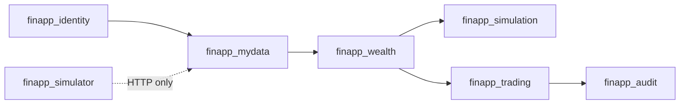

# 데이터 모델 v0

- 상태: Milestone 1~5 구현 기준선
- 작성일: 2026-09-01

이 문서는 논리 모델과 불변조건을 정의한다. 물리 이름, column, PK/FK/index는 `TABLE_DEFINITIONS.md`를 따른다. 실제 DDL은 Drizzle Kit versioned migration으로 구현하며 migration 변경 시 두 문서를 함께 갱신한다.

## 1. 공통 규칙

- primary key: UUID
- money: `numeric(19,4)`
- quantity: `numeric(19,8)`
- percentage: `numeric(12,8)`
- timestamp: `timestamptz`
- date: `date`
- currency: `varchar(3)`와 check constraint
- status: `varchar`와 check constraint
- raw payload: `jsonb`
- optimistic version이 필요한 row: `bigint version`
- 생성·변경 시간: `created_at`, `updated_at`
- 모든 애플리케이션 소유 schema/table/index/constraint 이름: `finapp_` prefix

모든 timestamp는 UTC 의미로 저장한다. 금액과 수량에 floating point DB 타입을 사용하지 않는다.

## 2. Schema 관계

`finapp_simulator` schema와 platform schema 사이에 foreign key를 만들지 않는다. 연결은 external identifier와 HTTP 계약으로만 이루어진다.

## 3. finapp_identity

### `finapp_identity.finapp_app_user`

| column | 설명 |
|---|---|
| `id` | 내부 user UUID |
| `status` | `ACTIVE`, `DISABLED` |
| `display_name` | 합성 표시명 |
| `created_at`, `updated_at` | 시간 |

### `finapp_identity.finapp_oidc_identity`

| column | 설명 |
|---|---|
| `id` | UUID |
| `user_id` | app_user FK |
| `issuer` | token issuer |
| `subject` | OIDC sub |
| `created_at` | 시간 |

제약: `(issuer, subject)` unique.

### `finapp_identity.finapp_risk_profile`

| column | 설명 |
|---|---|
| `user_id` | app_user PK/FK |
| `risk_level` | `CONSERVATIVE`, `BALANCED`, `GROWTH` |
| `investment_horizon_months` | 양수 |
| `monthly_contribution` | 0 이상 |
| `version` | optimistic version |

## 4. finapp_mydata

### `finapp_mydata.finapp_institution_connection`

| column | 설명 |
|---|---|
| `id` | connection UUID |
| `user_id` | 소유자 |
| `institution_code` | MVP `SYNTH_WEALTH_001` |
| `external_customer_id_ciphertext` | `FAE2` envelope: wrapped per-value DEK + AES-256-GCM IV/tag/ciphertext; legacy read는 local synthetic only |
| `masked_external_customer_id` | 표시용 값 |
| `status` | `ACTIVE`, `REVOKED`, `EXPIRED` |
| `consent_expires_at` | 동의 만료 |
| `last_successful_sync_at` | 마지막 성공 시간 |

제약: 사용자와 기관당 활성 connection 하나. partial unique index를 검토한다.

### `finapp_mydata.finapp_sync_job`

| column | 설명 |
|---|---|
| `id` | sync UUID |
| `connection_id` | connection FK |
| `status` | `QUEUED`, `FETCHING`, `RAW_STORED`, `NORMALIZING`, `COMPLETED`, `FAILED` |
| `attempt` | 실행 횟수 |
| `next_attempt_at` | retry 가능 시간 |
| `locked_at`, `locked_by` | worker claim |
| `error_code` | 안정적인 오류 코드 |
| `started_at`, `completed_at` | 실행 시간 |

동일 connection에 실행 상태인 job은 하나만 존재하도록 partial unique index를 사용한다.

### `finapp_mydata.finapp_raw_batch`

| column | 설명 |
|---|---|
| `id` | batch UUID |
| `sync_job_id` | sync FK |
| `resource_type` | `ACCOUNT`, `HOLDING`, `TRANSACTION` |
| `request_id` | simulator request 추적 |
| `schema_version` | payload schema version |
| `received_at` | 수신 시간 |
| `page_cursor` | 외부 cursor |
| `payload_checksum` | batch canonical checksum |

동일 payload 재수신도 새 batch row로 기록한다. checksum은 조회 index이며 전역 unique가 아니다.

### `finapp_mydata.finapp_raw_record`

| column | 설명 |
|---|---|
| `id` | raw UUID |
| `raw_batch_id` | batch FK |
| `resource_type` | resource type |
| `external_resource_id` | 기관 resource ID |
| `payload` | 원본 JSONB |
| `payload_checksum` | canonical record checksum |
| `received_at` | 수신 시간 |

제약: `(raw_batch_id, resource_type, external_resource_id)` unique.

`raw_record`는 INSERT 후 UPDATE/DELETE하지 않는다.

### `finapp_mydata.finapp_raw_processing_result`

| column | 설명 |
|---|---|
| `id` | UUID |
| `raw_record_id` | raw_record FK |
| `processor_version` | normalization version |
| `status` | `PROCESSED`, `DUPLICATE`, `INVALID`, `FAILED` |
| `derived_resource_type` | 생성된 내부 resource type |
| `derived_resource_id` | 생성된 내부 UUID |
| `error_code` | 오류 코드 |
| `processed_at` | 처리 시간 |

제약: `(raw_record_id, processor_version)` unique.

## 5. finapp_wealth

### `finapp_wealth.finapp_financial_account`

- `id`, `user_id`, `connection_id`
- `institution_code`, `external_account_id_hash`
- `masked_account_number`
- `account_type`, `currency`, `status`
- `opened_at`, `closed_at`

제약: `(connection_id, external_account_id_hash)` unique.

### `finapp_wealth.finapp_instrument`

- `id`, `instrument_code`, `display_name`
- `asset_class`, `currency`, `status`
- synthetic 상품만 저장

제약: `instrument_code` unique.

### `finapp_wealth.finapp_holding`

- `id`, `user_id`, `account_id`, `instrument_id`
- `quantity`, `average_price`
- `external_holding_id`
- `as_of_at`, `version`

제약: `(account_id, instrument_id)` unique. quantity는 0 이상.

### `finapp_wealth.finapp_financial_transaction`

- `id`, `user_id`, `account_id`
- `external_transaction_id`, `transaction_type`
- `amount`, `currency`, `occurred_at`
- `raw_record_id`

제약: `(account_id, external_transaction_id)` unique. 이 제약이 재동기화 중복을 막는 최종 방어선이다.

### `finapp_wealth.finapp_cash_account`

- `id`, `user_id`, `account_id`
- `available_balance`, `reserved_balance`, `currency`
- `version`, `updated_at`

불변조건:

- available과 reserved는 0 이상
- 주문 예약 시 available 감소와 reserved 증가 합계가 보존됨
- settlement 시 reserved 감소와 ledger 기록이 같은 transaction에 포함됨

### `finapp_wealth.finapp_asset_snapshot`

- `id`, `user_id`, `as_of_date`, `currency`
- `total_assets`, `cash_amount`, `investment_amount`
- allocation JSON이 아니라 별도 row 사용 가능

제약: `(user_id, as_of_date, currency)` unique.

### `finapp_wealth.finapp_asset_snapshot_allocation`

- `id`, `snapshot_id`, `asset_class`
- `amount`, `weight`

제약: `(snapshot_id, asset_class)` unique, weight는 0~1.

## 6. finapp_simulation

### `finapp_simulation.finapp_assumption_set`

- `id`, `version`, `status`
- 자산군별 expected return, volatility, fee
- correlation matrix JSONB
- `effective_from`, `created_at`

제약: version unique. 사용된 assumption row는 수정하지 않고 새 version을 만든다.

### `finapp_simulation.finapp_simulation_run`

- `id`, `user_id`, `engine_version`, `assumption_set_id`
- input snapshot JSONB
- `seed`, `path_count`, `duration_months`
- `status`, `created_at`, `completed_at`

### `finapp_simulation.finapp_simulation_result_summary`

- `simulation_run_id` PK/FK
- `goal_probability`
- `final_p10`, `final_p50`, `final_p90`
- `currency`

### `finapp_simulation.finapp_simulation_result_point`

- `simulation_run_id`, `month`
- `p10`, `p50`, `p90`

제약: `(simulation_run_id, month)` unique, `p10 <= p50 <= p90` check.

## 7. finapp_trading

### `finapp_trading.finapp_quote`

- `id`, `user_id`, `account_id`, `instrument_id`
- `side` check: MVP `BUY`
- `quantity`, `unit_price`, `estimated_amount`, `fee`, `currency`
- `expires_at`, `created_at`

### `finapp_trading.finapp_idempotency_record`

- `id`, `user_id`, `operation`, `idempotency_key`
- `request_hash`, `resource_type`, `resource_id`
- `response_status`, `response_snapshot` optional
- `created_at`, `expires_at`

제약: `(user_id, operation, idempotency_key)` unique.

### `finapp_trading.finapp_trade_order`

- `id`, `user_id`, `account_id`, `instrument_id`, `quote_id`
- `client_order_id`
- `side`, `quantity`, `estimated_amount`, `currency`
- `status`, `external_order_id`
- `version`, `created_at`, `updated_at`

제약:

- `client_order_id` unique
- status는 결정 문서의 7개 상태만 허용
- quantity와 estimated amount는 양수

### `finapp_trading.finapp_fund_reservation`

- `id`, `order_id`, `cash_account_id`
- `amount`, `status`
- `expires_at`, `created_at`, `released_at`, `settled_at`

제약: 주문당 활성 reservation 하나.

### `finapp_trading.finapp_order_execution`

- `id`, `order_id`, `external_execution_id`
- `quantity`, `unit_price`, `amount`, `executed_at`

제약: `external_execution_id` unique, MVP 주문당 execution 최대 하나.

### `finapp_trading.finapp_cash_ledger_entry`

- `id`, `cash_account_id`, `order_id`
- `entry_type`, `amount`, `balance_after`
- `occurred_at`

제약: `(order_id, entry_type)` unique로 중복 settlement를 막는다.

### `finapp_trading.finapp_position`

- `id`, `user_id`, `account_id`, `instrument_id`
- `quantity`, `average_price`, `version`

제약: `(account_id, instrument_id)` unique, quantity 0 이상.

### `finapp_trading.finapp_reconciliation_job`

- `id`, `order_id`, `status`, `attempt`
- `next_attempt_at`, `locked_at`, `locked_by`
- `last_error_code`, `created_at`, `completed_at`

제약: 주문당 활성 reconciliation job 하나.

### `finapp_trading.finapp_outbox_event` — Milestone 6

- aggregate와 event type
- redacted payload
- 처리 상태, attempt, available/processed time
- claim lease owner/time과 stable last error code

settlement transaction과 같은 transaction에서 INSERT한다.

### `finapp_trading.finapp_outbox_delivery` — Milestone 6

- event ID와 stable consumer name의 durable delivery receipt
- `(event_id, consumer_name)` unique로 재claim·재발행을 idempotent하게 만든다.
- local publisher의 상태이며 원격 broker나 개인정보 payload를 저장하지 않는다.

## 8. finapp_audit

### `finapp_audit.finapp_audit_event`

- `id`, `occurred_at`, `user_id`
- `action`, `resource_type`, `resource_id`
- `result`, `reason_code`, `trace_id`
- allowlist 기반 `metadata` JSONB

app role은 INSERT/SELECT만 가능하며 UPDATE/DELETE 권한이 없다. token, full identifier, plaintext PII와 전체 request body를 저장하지 않는다.

### `finapp_audit.finapp_security_event` — Milestone 6

인증·인가·비정상 접근 이벤트를 append-only로 저장한다. Token/subject/raw IP는 저장하지 않고 stable reason code, trace ID, keyed source-IP hash와 `requiredScopeCount`/`syntheticData` allowlist metadata만 허용한다.

### `finapp_crypto.finapp_data_keyring` — Milestone 6

KMS encrypted DEK, key version, algorithm과 scope metadata를 저장한다. plaintext DEK는 저장하지 않는다.

## 9. finapp_simulator

주요 table:

- `finapp_sim_customer`
- `finapp_sim_account`
- `finapp_sim_instrument`
- `finapp_sim_holding`
- `finapp_sim_transaction`
- `finapp_sim_market_price`
- `finapp_sim_order`
- `finapp_sim_scenario`

`finapp_sim_order.client_order_id`는 unique다. simulator role 외에는 접근할 수 없다.

## 10. 주문 Transaction 경계

### Tx A — 주문 생성과 예약

1. idempotency record 확인/생성
2. quote와 ownership/expiry 검증
3. cash account row lock
4. available balance 검증
5. fund reservation 생성
6. balance 이동
7. order를 `PENDING_SUBMISSION`으로 저장
8. commit

### 외부 호출

Tx A commit 후 simulator를 호출한다. 이 동안 DB transaction과 row lock을 유지하지 않는다.

### Tx B — 명확한 결과

- FILLED: execution, ledger, position, reservation settlement, order status, audit를 한 transaction에 저장
- REJECTED: reservation release, balance 복원, order status, audit를 한 transaction에 저장
- timeout: 짧은 transaction으로 UNKNOWN과 reconciliation job 저장

Tx B는 unique constraint와 현재 상태 확인으로 재실행에 안전해야 한다.

## 11. 핵심 불변조건

- 사용자는 다른 사용자의 account, simulation, order를 조회하거나 변경할 수 없다.
- 동일 외부 transaction은 derived 영역에 한 번만 존재한다.
- raw payload는 수정되지 않는다.
- platform DB role은 simulator table을 읽지 못한다.
- 총자산은 cash와 holding 평가금액 합계와 일치한다.
- asset history 날짜는 오름차순이며 중복되지 않는다.
- simulation은 `p10 <= p50 <= p90`이다.
- available/reserved balance는 음수가 아니다.
- 동일 idempotency key 주문 row는 하나다.
- 동일 execution/ledger event가 두 번 반영되지 않는다.
- 모든 외부 identifier는 API에 full value로 노출되지 않는다.
