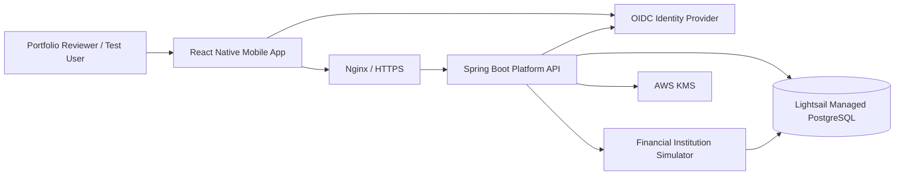
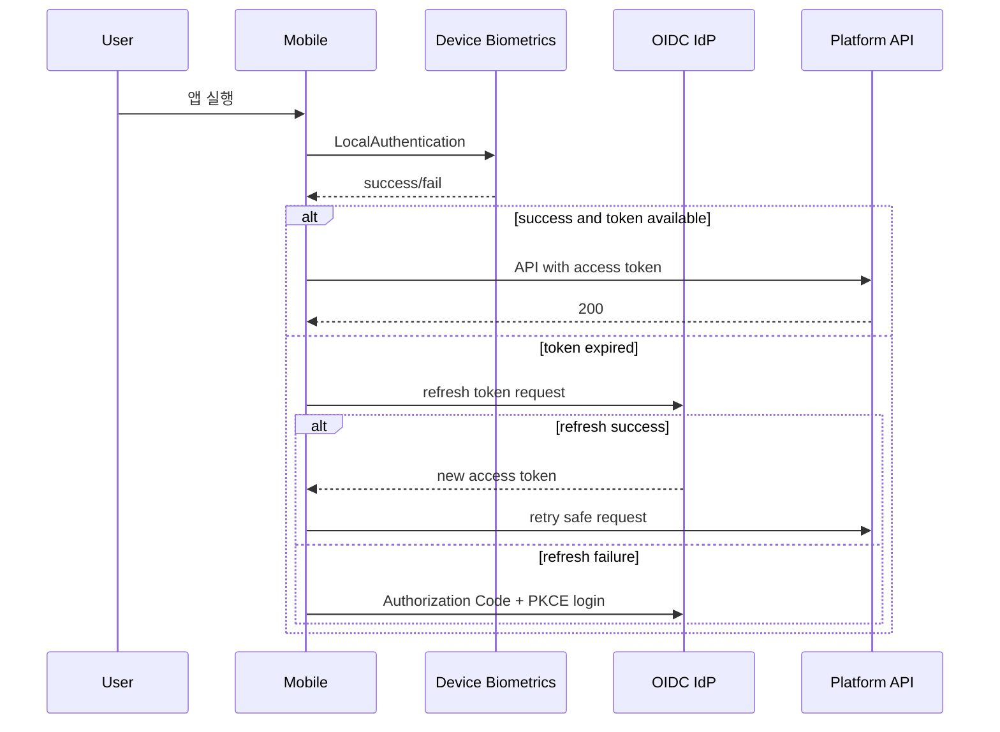
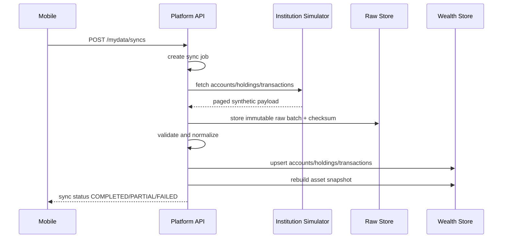
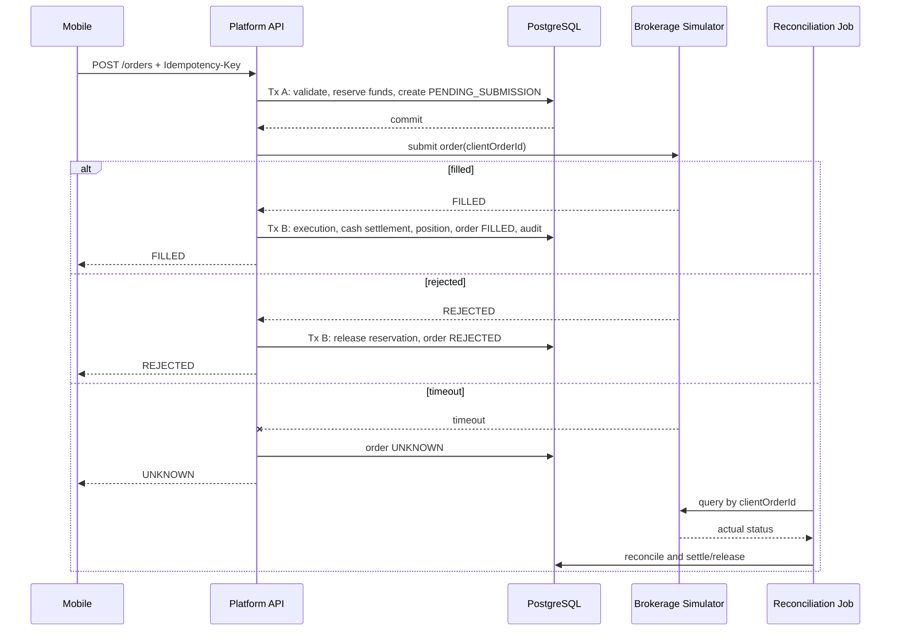
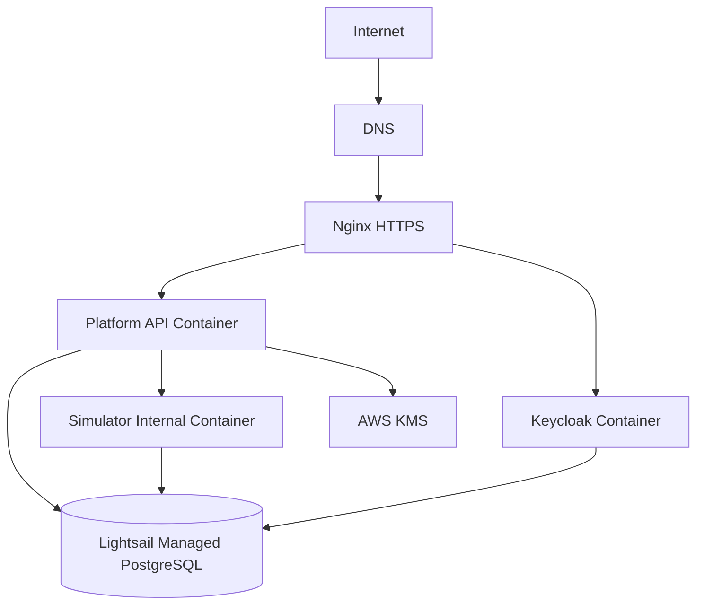

# Financial App Wealth Platform
## Codex 상세 구현 명세서

- 문서 파일명: `Financial_app_CODEX_DETAILED_IMPLEMENTATION_SPEC.md`
- 문서 목적: React Native 모바일 앱과 실제 Spring Boot 백엔드, 실제 PostgreSQL, 금융기관 시뮬레이터를 연결한 포트폴리오 프로젝트 구현 지시
- 대상 실행자: Codex
- 작성 기준일: 2026-09-01
- 문서 상태: 구현 기준선(Baseline)
- 우선순위 표기:
  - **MUST**: 반드시 구현
  - **SHOULD**: 핵심 완료 후 구현하면 좋은 항목
  - **MUST NOT**: 이번 프로젝트에서 제외하거나 해서는 안 되는 항목

---

# 0. Codex가 가장 먼저 읽어야 할 요약

이 프로젝트는 실제 금융서비스를 만드는 것이 아니다. **금융 데이터와 외부 금융기관만 합성 데이터 및 시뮬레이터로 대체하고, 모바일 앱·백엔드·DB·인증·트랜잭션·암호화·감사로그·장애처리·배포는 실제로 구현하는 포트폴리오**다.

핵심 정의는 다음과 같다.

> Synthetic인 것은 고객의 금융 데이터, 시세, 금융기관, 주문 체결 결과다.  
> 실제로 구현하는 것은 React Native 앱, HTTP 통신, Spring Boot API, PostgreSQL 영속화, OAuth2/OIDC, 생체인증, 세션 처리, 서버사이드 금융 시뮬레이션, 외부기관 연동 패턴, 주문 정합성, KMS 기반 암호화, 접근통제, 감사로그, 테스트와 배포다.

이 프로젝트는 한화생명 PLUS WM전략팀의 공개 채용공고에서 요구하는 다음 역량을 포트폴리오로 증명하기 위한 독립 프로젝트다.

- 신규 모바일 금융 플랫폼 아키텍처
- React Native, TypeScript, Expo
- TanStack Query, Zustand
- 생체인증, Secure Storage, 세션 만료와 재인증
- 모바일 차트와 Reanimated
- Java 기반 프로덕션 백엔드
- PostgreSQL 스키마와 트랜잭션 정합성
- OAuth2/OIDC
- 마이데이터 전송요구·정기전송을 모사한 수집 파이프라인
- 증권 주문·시세·계좌확인 외부 API 연동 패턴
- 원본 데이터와 서비스 파생 데이터 경계
- KMS 암호화, 접근통제, 감사로그
- 외부기관 장애·지연·중복 요청·결과 불명 상태에 대한 복구

**한화생명, PLUS, 한화투자증권의 상호·로고·브랜드 컬러·실제 상품명·실제 화면을 복제하지 않는다.** 앱은 독립적인 가상 브랜드와 가상 기관, 가상 금융상품만 사용한다.

---

# 1. Codex 작업 원칙

## 1.1 구현 전에 반드시 수행할 일

Codex는 코드를 작성하기 전에 다음을 수행한다.

1. 저장소 전체 구조, 기존 코드, 빌드 도구, 린트·테스트 규칙, Docker 구성, CI 설정을 조사한다.
2. 기존 코드가 있다면 전면 재작성하지 말고 기존 규칙을 우선 존중한다.
3. 저장소가 비어 있거나 신규 프로젝트라면 본 문서의 권장 모노레포 구조를 사용한다.
4. 사용 가능한 AWS/Lightsail 환경 설정 파일이 있는지 확인하되, 실제 비밀정보를 출력하거나 커밋하지 않는다.
5. 기존 Lightsail Managed PostgreSQL에 다른 서비스 데이터가 있다면 절대 기존 DB·스키마·테이블을 삭제하거나 이름을 변경하지 않는다.
6. 다음 문서를 먼저 생성한다.
   - `docs/IMPLEMENTATION_DECISIONS.md`
   - `docs/IMPLEMENTATION_STATUS.md`
   - `docs/adr/ADR-0001-system-boundaries.md`
   - `docs/adr/ADR-0002-identity-provider.md`
   - `docs/adr/ADR-0003-database-isolation.md`
7. 최종 라이브러리 버전은 이 문서의 작성 시점 값을 복사하지 말고 공식 호환성 문서를 확인하여 현재 안정 버전으로 확정한다.

## 1.2 의사결정 우선순위

구현 중 선택지가 충돌하면 아래 순서로 결정한다.

1. 보안과 데이터 손상 방지
2. 본 문서의 MUST 완료 조건
3. 기존 저장소의 일관성
4. 테스트 가능성과 재현성
5. 구현 단순성
6. 포트폴리오 시연 가치
7. 최신 기술을 많이 사용하는 것

기술을 많이 넣는 것보다 **끝까지 동작하고 검증되는 하나의 흐름**이 우선이다.

## 1.3 Codex가 해서는 안 되는 행동

- 실제 금융기관 API를 연결한 것처럼 가장하지 않는다.
- 가짜 보안성 심의 통과, 마이데이터 인증, 금융규제 준수를 주장하지 않는다.
- 실사용자 개인정보나 실제 계좌정보를 저장하지 않는다.
- 실제 주문 가능 기능이나 실제 투자 추천 기능을 만들지 않는다.
- 기존 Lightsail DB에 `DROP DATABASE`, `DROP SCHEMA`, `Flyway clean`을 실행하지 않는다.
- 외부 API 호출을 유지한 채 하나의 긴 DB 트랜잭션으로 묶지 않는다.
- 토큰, DB 비밀번호, KMS 키 식별자, 관리자 비밀번호를 코드나 Git에 커밋하지 않는다.
- React Query 캐시와 Zustand에 동일한 서버 데이터를 중복 보관하지 않는다.
- 생체인증 결과를 서버가 검증한 MFA인 것처럼 설명하지 않는다.
- 테스트를 통과하지 않은 상태를 완료로 표시하지 않는다.

---

# 2. 프로젝트 목표와 성공 기준

## 2.1 프로젝트 목표

가상의 자산관리 모바일 플랫폼을 다음 흐름으로 완성한다.

```text
React Native App
    → OAuth2/OIDC 로그인
    → 실제 Spring Boot API 호출
    → 실제 Lightsail PostgreSQL 조회
    → 가상 마이데이터 기관 HTTP 연동
    → 원본 데이터 적재 및 정규화
    → 자산·포트폴리오 조회
    → 서버사이드 자산 시뮬레이션
    → 가상 주문 생성
    → 가상 증권사 HTTP 연동
    → 실제 주문 상태·현금·보유수량 DB 갱신
    → 차트와 애니메이션으로 결과 표시
```

## 2.2 포트폴리오에서 증명해야 할 것

완성된 프로젝트는 다음 질문에 코드와 실행 화면으로 답할 수 있어야 한다.

- 모바일과 서버의 책임을 어떻게 분리했는가?
- TanStack Query와 Zustand를 왜 나누어 사용했는가?
- OAuth2/OIDC와 모바일 생체인증은 각각 어떤 보안 경계를 담당하는가?
- 서버 토큰이 만료되거나 앱이 잠겼을 때 어떤 흐름으로 복구하는가?
- 금융기관이 timeout을 내고 주문 결과가 불명확해졌을 때 중복 주문을 어떻게 막는가?
- 마이데이터 원본과 서비스용 파생 데이터를 왜 분리했는가?
- 동일 주문이 두 번 전송되어도 왜 한 번만 처리되는가?
- 동시에 두 주문이 들어와 잔액을 초과하려 할 때 어떻게 정합성을 지키는가?
- 민감 필드를 KMS와 envelope encryption으로 어떻게 보호하는가?
- Synthetic data를 어떻게 재현 가능하게 만들었는가?
- 차트에 보이는 수치는 단순 하드코딩이 아니라 어떤 서버 계산 결과인가?
- 장애 시나리오를 어떻게 재현하고 테스트하는가?

## 2.3 성공의 최소 단위

다음 단일 시나리오가 원격 배포 환경에서 처음부터 끝까지 실제 동작해야 한다.

1. 사용자가 OIDC로 로그인한다.
2. 앱 잠금 상태를 실제 생체인증으로 해제한다.
3. 앱이 백엔드에서 자산 데이터를 불러온다.
4. 사용자가 가상 마이데이터 동기화를 실행한다.
5. 백엔드가 별도 금융기관 시뮬레이터를 HTTP로 호출한다.
6. 원본 JSON이 raw 영역에 저장되고 정규화된 계좌·보유자산이 갱신된다.
7. 앱에서 총자산·자산배분·자산추이 차트를 확인한다.
8. 사용자가 투자기간과 월 납입액을 입력해 시뮬레이션을 실행한다.
9. 백엔드가 재현 가능한 서버사이드 계산을 수행하고 p10/p50/p90 결과를 반환한다.
10. 사용자가 가상 상품 주문을 제출하기 전 생체인증을 수행한다.
11. 백엔드는 멱등성 키를 검증하고 주문을 생성한 후 가상 증권사 API를 호출한다.
12. 체결 결과에 따라 현금, 보유수량, 주문, 체결, 감사로그가 실제 DB에서 변경된다.
13. TanStack Query가 관련 쿼리를 무효화하여 차트와 포트폴리오가 갱신된다.
14. 같은 주문 요청을 재전송해도 주문은 하나만 존재한다.
15. simulator timeout 모드에서는 주문이 중복 생성되지 않고 `UNKNOWN` 상태 후 재조회로 복구된다.

---

# 3. 범위 확정

# 3.1 반드시 구현할 것 — MUST

## A. 모바일

- React Native + TypeScript
- Expo 기반 프로젝트
- Expo Development Build
- iOS와 Android 빌드 가능 상태
- Expo Router 또는 현재 저장소의 검증된 내비게이션 구조
- TanStack Query
- Zustand
- 실제 OAuth2 Authorization Code + PKCE 기반 OIDC 로그인
- 토큰의 안전한 로컬 보관
- 실제 기기 생체인증
- 앱 잠금, 세션 만료, 토큰 갱신 실패, 재로그인 흐름
- 서버 API의 loading, empty, error, retry 상태
- 총자산, 계좌, 보유자산, 거래내역
- 포트폴리오 자산배분
- 서버사이드 시뮬레이션 입력과 결과
- 주문 미리보기, 주문 제출, 결과와 이력
- Victory Native 계열의 현재 호환 차트 라이브러리
- React Native Reanimated
- 개발자 장애 시나리오 패널
- 최소 접근성: 스크린리더 라벨, 터치 영역, Reduce Motion 고려

## B. 백엔드

- Java 21 계열의 현재 지원 버전
- Spring Boot
- Spring Security OAuth2 Resource Server
- PostgreSQL
- Flyway migration
- 모듈형 모놀리스 구조
- OpenAPI 문서
- 요청 검증과 표준 에러 응답
- 가상 사용자 프로필과 투자성향
- 마이데이터 연결·동의·수동 동기화·정기 동기화
- raw 데이터 저장과 파생 도메인 데이터 분리
- 자산·계좌·보유자산·거래내역 API
- 포트폴리오 집계 API
- 서버사이드 시뮬레이션 엔진
- 가상 주문 미리보기와 주문 처리
- 주문 멱등성
- 주문 상태 머신
- 현금 예약과 해제
- 주문 timeout 후 reconciliation
- PostgreSQL 트랜잭션·락·제약조건을 이용한 정합성
- KMS 기반 envelope encryption의 원격 배포 프로필
- 로컬 테스트용 키 공급자
- 역할·scope·소유권 기반 접근통제
- 감사로그와 보안 이벤트
- 구조화 로그, trace/correlation ID, health check
- 외부기관 HTTP client의 timeout, 제한된 retry, circuit breaker
- Testcontainers 기반 통합 테스트
- 동시성·중복 요청 테스트

## C. 금융기관 시뮬레이터

플랫폼 백엔드와 **별도 프로세스 및 별도 DB 권한**으로 실행한다.

- 가상 마이데이터 기관 API
- 가상 시세 API
- 가상 증권 주문 API
- 가상 계좌확인 API
- 정상, 지연, timeout, HTTP 500, 잘못된 응답, 주문 거절, 결과 불명 시나리오
- 고정 seed 기반의 재현 가능한 합성 데이터
- 플랫폼 백엔드가 simulator DB를 직접 조회하지 못하도록 권한 분리
- OpenAPI 또는 명시적 API 계약
- simulator reset/reseed 기능
- 원격 배포 시 외부 인터넷에 직접 노출하지 않음

## D. 인프라와 배포

- 로컬 Docker Compose
- 실제 Lightsail Managed PostgreSQL 연동
- 기존 DB와 격리된 database 또는 schema와 전용 role
- DB SSL 연결
- Lightsail 인스턴스 또는 현재 사용 중인 동등한 서버에 API 배포
- Nginx 또는 동등한 reverse proxy
- HTTPS
- CI에서 lint, test, build
- 수동 승인 기반 배포
- EAS Development/Preview Build
- `.env.example`
- 실제 비밀정보가 없는 실행 문서
- 배포 후 smoke test

## E. 문서와 포트폴리오

- 시스템 구성도
- 주요 sequence diagram
- 데이터가 synthetic임을 명확히 밝히는 README
- 실제 구현과 simulator 구현 경계 표
- 테스트 실행 방법
- 로컬 실행 방법
- 원격 실행 방법
- 장애 시나리오 시연 방법
- 3분 데모 시나리오
- 제한사항과 보안상 미구현 항목
- 채용공고 요구사항 대응표
- 실제 웹 전환 경력으로 과장하지 않는 `WEB_TO_MOBILE_DESIGN_RULES.md`

---

# 3.2 있으면 좋은 것 — SHOULD

핵심 MUST를 전부 완료한 후에만 진행한다.

- EAS Update
- TestFlight 또는 Play Internal Testing
- App Store/Google Play 권한·개인정보·심사 준비 체크리스트와 mock release notes
- push notification
- 주문 상태 변경 SSE 또는 WebSocket
- TanStack Query 영속 캐시와 제한적 오프라인 읽기
- 관리자용 간단한 웹 콘솔
- 커스텀 Swift/Kotlin 네이티브 모듈 예제 1개
- 실제 AWS KMS 키 회전 운영 절차
- Secrets Manager 또는 Parameter Store 연동
- OpenTelemetry 분산 추적
- Prometheus/Grafana 대시보드
- k6 성능 테스트와 결과 보고서
- 읽기 전용 DB 사용자와 운영 분석 사용자 추가 분리
- 다기관 동기화와 기관별 부분실패 UX
- 부분 체결
- 매도 주문
- 시장 휴장 캘린더
- 다크 모드
- 다국어
- 데이터 내보내기
- 앱 스크린샷 자동화
- 접근성 자동 점검
- device-bound key 또는 native keystore signing을 통한 고도화된 step-up 인증 실험

`SHOULD`가 MUST 완성을 지연시키면 구현하지 않는다.

---

# 3.3 과감히 제외할 것 — MUST NOT

- 실제 금융기관 및 마이데이터 API
- 실제 주식·ETF 시세
- 실제 주문과 실계좌
- 실제 신원·계좌 실명확인
- 실제 고객 개인정보
- 실제 투자자문 또는 수익률 보장 표현
- 실제 금융규제 인증, 보안성 심의, 정보보호위원회 절차
- 보안키패드
- 앱 위변조 방지 솔루션
- 루팅·탈옥 탐지
- 모바일 백신
- 인증서 pinning
- 복잡한 단말 attestation
- 실제 공인전자서명
- 실시간 초고빈도 시세 스트리밍
- Kafka 도입
- Kubernetes/EKS
- 서비스별 DB를 가진 다수의 마이크로서비스
- 다중 리전, active-active, 복잡한 DR
- 신용평가·대출심사 모델
- LLM, RAG, AI Agent
- 고급 퀀트 모델, 실제 투자 예측 ML
- 웹 프론트엔드
- 한화생명·PLUS UI 복제
- 일반 사용자를 대상으로 한 앱스토어 정식 공개
- 모바일 SQLite를 금융 데이터의 원본 저장소로 사용하는 구조

---

# 4. 공개 채용공고 요구사항과 구현 대응

공개 채용공고 기준 URL:

- 모바일 직무: 사용자가 제공한 공고 본문 기준
- 백엔드 직무: `https://www.bzpp.co.kr/biz/businessDetailView/BR260821A00084`

| 채용공고 요구 | 이 프로젝트의 대응 | 한계 |
|---|---|---|
| 시스템 전체 아키텍처 | 모바일, 플랫폼 API, IdP, simulator, PostgreSQL, 배포 설계 | 실제 사내 시스템 아님 |
| 도메인 엔진 서버사이드 실행 | 포트폴리오 및 Monte Carlo형 시뮬레이션 엔진 | 합성 가정 사용 |
| 마이데이터 전송요구·정기전송 | consent + manual/scheduled sync + raw ingestion | 실제 표준·기관 계약 아님 |
| 매매 주문·시세 API | 별도 simulator와 실제 HTTP 연동 | 실제 증권사 아님 |
| 원장·계정계·계좌확인 | simulator 내부 계좌 원천과 검증 API | 실제 원장 아님 |
| OAuth2/OIDC | PKCE 로그인 + Resource Server JWT 검증 | IdP는 Keycloak 또는 승인된 대안 |
| 원본/파생 경계 | `mydata_raw`와 서비스 도메인 schema 분리 | 물리 서버 분리는 아님 |
| KMS·암호화 | AWS KMS envelope encryption | 실데이터 없음 |
| 접근통제 | scope, role, resource ownership | 실제 조직 IAM 아님 |
| 접속기록·감사로그 | append-only audit/security event | 법적 보관 인증 아님 |
| PostgreSQL 설계·튜닝 | 제약, index, transaction, lock, execution plan 기록 | 대규모 트래픽 검증은 제한 |
| 외부기관 API 주관 | OpenAPI 계약, simulator, contract test | 실제 기관 협의 경력 대체 불가 |
| React Native/Expo | 실제 iOS·Android 개발 빌드 | 스토어 정식 출시 경력 아님 |
| 상태관리·내비게이션 | TanStack Query/Zustand 책임 분리, 인증·탭·모달 흐름 | 실제 대규모 팀 표준화 경험은 아님 |
| 웹→모바일 전환 표준 | 모바일 컴포넌트·레이아웃·인터랙션 원칙과 전환 판단 문서 | 실제 운영 웹을 전환한 프로젝트는 아니므로 해당 경력으로 주장 금지 |
| 생체인증 | 실제 Face ID/Touch ID/Android Biometrics | 서버가 생체정보를 검증하지 않음 |
| Keychain·Keystore 계열 저장 | Expo SecureStore와 토큰 저장정책 | 상용 보안모듈 인증 아님 |
| 차트·Reanimated | 실제 라이브러리 기반 인터랙션 | 합성 데이터 |
| 세션 만료·재인증 | 401, refresh single-flight, app lock, 재로그인 | 상용 금융 보안 모듈 아님 |
| App Store·Google Play 대응 | EAS Development/Preview Build, 권한·개인정보·릴리스 체크리스트 | 실제 심사 제출·리젝 대응 경력은 아님 |
| 개발 리딩·코드리뷰 | ADR, coding rule, quality gate, PR template | 실제 팀 리딩 경력의 대체물은 아님 |

README와 이력서에는 위 한계를 숨기지 않는다.

## 4.1 이 프로젝트만으로 대체할 수 없는 경력

다음은 코드로 이해와 준비 수준을 보여줄 수는 있지만, 실제 경력으로 주장해서는 안 된다.

- 금융기관과의 실제 API 규격 협의
- 마이데이터 사업자 인증 및 전송요구 표준 적합성 검증
- 금융권 정보보호위원회·보안성 심의
- 상용 보안키패드·위변조 방지·모바일 백신 통합
- App Store/Google Play 실제 심사와 리젝 조치
- 운영 웹서비스를 실제 모바일 앱으로 전환한 경험
- 여러 개발자를 관리한 조직 리딩 경험
- 금융앱 상용 출시 및 운영 경력

대신 포트폴리오에서는 **이 요구를 어떻게 해석하고 어떤 시스템 경계·테스트·문서로 준비했는지**를 보여준다.

---

# 5. 시스템 아키텍처

## 5.1 시스템 컨텍스트



## 5.2 배포 단위

반드시 필요한 런타임 단위는 다음과 같다.

1. `mobile`
2. `platform-api`
3. `institution-simulator`
4. `identity-provider`
5. `postgresql`
6. `reverse-proxy`

`platform-api`는 모듈형 모놀리스다. 도메인을 무리하게 마이크로서비스로 분리하지 않는다.  
`institution-simulator`만 외부기관 경계를 보여주기 위해 별도 프로세스로 둔다.

## 5.3 권장 저장소 구조

기존 저장소가 없다면 다음 구조를 사용한다.

```text
financial-app/
├── apps/
│   └── mobile/
├── services/
│   ├── platform-api/
│   └── institution-simulator/
├── infra/
│   ├── docker/
│   ├── nginx/
│   ├── keycloak/
│   ├── database/
│   └── scripts/
├── docs/
│   ├── adr/
│   ├── diagrams/
│   ├── API_CONTRACTS.md
│   ├── DATA_MODEL.md
│   ├── SECURITY_MODEL.md
│   ├── TEST_STRATEGY.md
│   ├── DEPLOYMENT.md
│   ├── IMPLEMENTATION_DECISIONS.md
│   └── IMPLEMENTATION_STATUS.md
├── .github/
│   └── workflows/
├── .env.example
├── docker-compose.yml
├── Makefile 또는 justfile
└── README.md
```

기존 저장소가 이와 다르면 구조를 강제로 바꾸지 말고, 동일한 책임 경계만 유지한다.

---

# 6. 기술 기준선

정확한 버전은 구현 시점의 공식 호환성 표를 확인해 고정한다.

## 6.1 모바일

- React Native
- TypeScript strict mode
- Expo
- Expo Development Build
- Expo Router
- TanStack Query
- Zustand
- Expo AuthSession 또는 선택한 IdP의 검증된 React Native SDK
- Expo SecureStore
- Expo LocalAuthentication
- Victory Native
- React Native Skia
- React Native Reanimated
- React Native Gesture Handler
- React Native Testing Library
- Maestro 또는 동등한 모바일 E2E 도구

Reanimated 4를 선택하는 경우 React Native New Architecture 호환성을 반드시 확인한다.  
Victory Native, Skia, Reanimated의 peer dependency 조합은 공식 문서를 기준으로 잠근다.

## 6.2 백엔드

- Java 21
- Spring Boot
- Spring Security
- OAuth2 Resource Server
- Spring Data JPA
- PostgreSQL
- Flyway
- Bean Validation
- WebClient
- Resilience4j
- Spring Actuator
- Micrometer
- springdoc-openapi
- Testcontainers
- JUnit 5
- Gradle Kotlin DSL 권장

기존 백엔드가 jOOQ, MyBatis, Maven 등을 일관되게 사용하면 그 구조를 존중할 수 있다. 단, 변경 이유를 ADR에 남긴다.

## 6.3 Identity Provider

프로토콜 요구사항은 고정한다.

- OpenID Connect
- OAuth2 Authorization Code Flow
- PKCE S256
- 모바일 public client
- JWT access token
- refresh token
- issuer/audience/scope 검증

기본 구현은 Keycloak이다. 현재 Lightsail 인스턴스 자원으로 Keycloak 운영이 불안정한 경우에만 AWS Cognito 같은 관리형 IdP로 변경할 수 있다. 변경 시 `ADR-0002-identity-provider.md`에 다음을 기록한다.

- 선택 이유
- 비용
- 로컬 개발 방식
- redirect URI
- token TTL
- logout/revocation 한계
- 모바일 SDK 선택

직접 만든 단순 JWT 로그인으로 대체하지 않는다.

---

# 7. 브랜드와 데이터 정책

## 7.1 브랜드

임시 서비스명은 `Wealth Sandbox`를 사용한다. 최종 이름은 변경 가능하지만 다음은 금지한다.

- 한화생명
- PLUS
- 한화투자증권
- 실제 금융기관 로고
- 실제 상품명
- 실제 금융기관 UI의 복제

## 7.2 데이터 원칙

모든 데이터는 synthetic이어야 한다.

- 실명 대신 `테스트 사용자 A`, `테스트 사용자 B`
- 가상 기관명 사용
- 가상 금융상품과 가상 종목코드 사용
- 실제 계좌번호 사용 금지
- 실제 전화번호·주민번호·이메일 사용 금지
- README와 앱 설정 화면에 `Synthetic Financial Data` 표시
- 시뮬레이션 화면에 `투자 조언이 아닌 기술 시연용 가상 계산` 표시

## 7.3 재현 가능한 seed

무작위값을 요청 시점마다 생성하지 않는다.

- 데이터셋 버전: 예 `FINANCIAL_APP_DATASET_V1`
- PRNG seed 고정
- 기준일 `asOfDate` 명시
- reset 시 같은 seed는 같은 데이터 생성
- 다른 preset은 명시적 seed 사용
- 테스트 데이터 생성기와 운영 demo seed를 분리

권장 preset:

1. `BALANCED_WORKER`
   - 중간 위험
   - 은행·증권·연금 계좌
   - 총자산 약 1.8억 원
   - 월 적립액 150만 원
2. `PRE_RETIREE`
   - 낮은 위험
   - 예금·채권·연금 중심
   - 총자산 약 4.2억 원
3. `GROWTH_INVESTOR`
   - 높은 위험
   - 주식형 가상 상품 중심
   - 총자산 약 7,500만 원

## 7.4 데이터 불변조건

seed generator와 모든 mutation은 다음을 만족해야 한다.

- 통화는 명시적으로 저장한다.
- 금액 합계는 반올림 규칙을 통일한다.
- 현재 총자산은 계좌별 자산 합과 일치한다.
- 보유상품 평가금액은 수량 × 최신 가상 시세와 일치한다.
- 주문 체결 후 현금 감소·보유수량 증가가 동일한 settlement transaction에 반영된다.
- 매도 구현 시 보유수량보다 많이 팔 수 없다.
- 보유 현금보다 큰 매수는 거절된다.
- 주문·체결·ledger·position 간 외래키와 상태가 모순되지 않는다.
- asset history 날짜는 오름차순이며 중복되지 않는다.
- simulation p10 ≤ p50 ≤ p90을 만족한다.
- 모든 timestamps는 UTC로 저장하고 앱에서 사용자 지역시간으로 표시한다.

---

# 8. 모바일 상세 설계

## 8.1 모바일의 책임

모바일은 다음을 담당한다.

- 사용자 인증 시작
- 토큰의 안전한 저장과 갱신 orchestration
- 앱 잠금 및 실제 생체인증
- 서버 데이터 조회·변경 요청
- 입력값 검증의 1차 UX
- 서버 결과 시각화
- 네트워크·세션·오류 상태 UX
- 개발자 시나리오 조작 UI
- 접근성 및 크로스플랫폼 동작

모바일은 다음을 담당하지 않는다.

- 포트폴리오의 원본 진실
- 총자산 계산의 최종 권위
- 수익률 시뮬레이션
- 주문 정합성
- 권한 판정
- 실제 session 유효성 판정
- 민감 데이터 원본 장기 저장

## 8.2 화면 목록

### 1. Boot/Splash

- 앱 설정 로드
- SecureStore 상태 확인
- IdP discovery 확인
- QueryClient 준비
- 앱 잠금 여부 판정
- 실패 시 복구 가능한 오류 화면

### 2. Login

- OIDC 로그인 버튼
- Authorization Code + PKCE
- 로그인 취소·실패 UX
- redirect/deep link 처리
- 최초 로그인 후 `/me` 호출

### 3. Biometric App Lock

- 지원 여부 확인
- 등록된 생체인증 여부 확인
- 성공, 실패, 사용자 취소, lockout 분기
- 실패 시 OIDC 재로그인 fallback
- 생체인증을 서버 MFA로 표현하지 않음

### 4. Onboarding / Risk Profile

- 투자목표
- 투자기간
- 월 추가금액
- 손실 감수 성향
- 결과 저장은 서버 API
- 입력 중 draft만 Zustand

### 5. Dashboard

- 총자산
- 전일 또는 기준일 대비 변화
- 자산추이 line/area chart
- 자산배분 donut chart
- 최근 동기화 시각
- 동기화 버튼
- loading/skeleton, empty, error, stale 상태

### 6. Accounts & Assets

- 기관별 계좌
- 계좌별 현금·상품
- full account identifier는 앱에 전달하지 않고 masked value만 사용
- pagination 또는 cursor
- 계좌 상세

### 7. Portfolio

- 현재 배분
- 목표 배분
- 자산군별 수익률
- 기간 선택
- 차트 touch tooltip
- 추천 설명은 규칙 기반 synthetic content

### 8. Simulation Setup

- 초기자산
- 월 납입액
- 기간
- 목표금액
- 위험 프로필
- 현재/추천 포트폴리오 선택
- draft는 Zustand
- 실행 시 서버 mutation

### 9. Simulation Result

- p10/p50/p90 시계열
- 목표 달성 확률
- 최종 예상 범위
- 사용 assumption version
- disclaimer
- slider나 비교 전환을 Reanimated로 부드럽게 표시

### 10. Order Preview

- 가상 상품
- BUY/SELL
- 수량
- 가상 quote
- 예상 금액
- quote expiration
- 수수료가 필요하면 synthetic fee
- 실제 생체인증 후 제출

### 11. Order Result / History

- 상태: pending, accepted, filled, rejected, unknown, failed
- 결과 불명 상태 설명
- retry가 아니라 status refresh 제공
- 주문 이력
- 멱등성 키는 UI에 노출하지 않되 개발 로그에서 추적 가능

### 12. Settings / Developer Scenario Panel

일반 설정과 개발 메뉴를 분리한다.

- 계좌 금액 가리기
- 로그아웃
- 데이터셋 정보
- synthetic disclaimer
- developer mode에서만:
  - next API 401
  - platform API latency
  - simulator latency
  - simulator timeout
  - HTTP 500
  - order reject
  - order unknown then filled
  - malformed response
  - dataset reset
  - session/app lock
  - large chart dataset

production profile에서는 developer endpoint와 UI를 비활성화한다.

## 8.3 Navigation

권장 구조:

```text
Root
├── AuthStack
│   ├── Login
│   └── AuthCallback
├── AppLock
└── AuthenticatedTabs
    ├── Home
    ├── Portfolio
    ├── Simulation
    ├── Orders
    └── Settings
        ├── AccountDetail
        ├── OrderPreviewModal
        ├── OrderResult
        └── DeveloperPanel
```

인증 상태와 내비게이션 상태를 억지로 한 store에 넣지 않는다.

## 8.4 TanStack Query 역할

TanStack Query는 **서버 상태**만 담당한다.

예시 query key:

```text
['me']
['accounts', filters]
['account', accountId]
['asset-summary']
['portfolio', 'current']
['portfolio', 'history', range]
['recommendation', 'current']
['orders', filters]
['order', orderId]
['simulation', simulationId]
['mydata-sync', syncId]
```

필수 규칙:

- GET 계열만 제한적으로 자동 retry
- 4xx는 일반적으로 retry하지 않음
- 주문 POST는 자동 retry하지 않음
- 주문 재전송이 필요하면 동일 idempotency key와 status reconciliation 사용
- 401 갱신은 single-flight로 구현
- 여러 요청이 동시에 401이어도 refresh 요청은 한 번만 수행
- refresh 성공 후 안전한 요청만 재시도
- 주문 제출 결과가 불명확하면 동일 POST 반복보다 주문 상태 조회
- AppState와 focusManager 연동
- 네트워크 상태와 onlineManager 연동
- 로그아웃 시 QueryCache 제거
- 계좌 동기화 완료 후 accounts, summary, portfolio 무효화
- 주문 체결 후 cash, holdings, portfolio, orders 무효화

## 8.5 Zustand 역할

Zustand는 **앱 내부의 비서버 상태**만 담당한다.

권장 store:

- `authUiStore`
  - 앱 잠금 표시
  - reauth modal 상태
  - 토큰 저장 금지
- `onboardingDraftStore`
  - 입력 중 draft
- `simulationDraftStore`
  - 서버 제출 전 시뮬레이션 입력값
- `uiPreferencesStore`
  - 금액 숨김
  - 선택 기간
  - reduced animation override
- `developerScenarioStore`
  - dev panel 입력값

금지:

- 계좌 목록을 Zustand에 복제
- 포트폴리오를 Zustand에 복제
- 주문 이력을 Zustand에 복제
- access/refresh token을 Zustand persist로 저장
- Query 결과를 Zustand에 동기화하는 effect

persist가 필요하면 비민감 UI 설정만 AsyncStorage 등에 저장한다.

## 8.6 모바일 로컬 저장소 정책

기존 아이디어의 SQLite는 서버가 없는 버전에는 적합했지만, 본 프로젝트에서는 서버가 실제 source of truth다.

따라서:

- `SecureStore`: refresh token, 최소한의 인증 관련 secret
- 메모리: access token
- `AsyncStorage` 또는 동등 저장소: 비민감 UI preference
- TanStack Query persistence: SHOULD
- SQLite: MUST 범위에서 제외

민감 계좌·보유자산을 모바일 SQLite에 장기 저장하지 않는다.

## 8.7 생체인증과 세션



중요한 보안 표현:

- 생체인증 성공은 로컬 앱 잠금을 푸는 조건이다.
- backend는 생체정보나 Face ID 결과를 직접 검증하지 않는다.
- 주문 전 생체인증은 local step-up UX다.
- 서버는 여전히 OIDC 토큰·scope·소유권·idempotency를 검증한다.

## 8.8 차트와 애니메이션

MUST 차트:

- 총자산 추이: line/area
- 자산배분: donut
- 시뮬레이션: p10/p50/p90 multi-series
- 포트폴리오 비교: bar 또는 stacked bar

MUST interaction:

- press/pan tooltip
- 기간 변경
- 로딩 전환
- 배분 변경 시 부드러운 값 변화
- Reduce Motion 설정 반영

성능 규칙:

- 원시 시계열을 무제한 전달하지 않는다.
- range별 서버 downsampling 또는 제한된 point 수를 사용한다.
- chart render마다 대형 객체를 재생성하지 않는다.
- memoization과 selector를 사용한다.
- JavaScript thread에서 불필요한 연속 계산을 하지 않는다.
- release build에서 iOS/Android를 모두 확인한다.
- debug에서만 정상이고 release에서 깨지는 상태를 완료로 보지 않는다.

---

# 9. 백엔드 상세 설계

## 9.1 아키텍처 스타일

`platform-api`는 모듈형 모놀리스와 ports/adapters 원칙을 사용한다.

권장 package-by-feature:

```text
com.example.financialapp
├── common
├── identity
├── mydata
├── wealth
├── portfolio
├── simulation
├── trading
├── integration
├── crypto
├── audit
└── developer
```

각 feature 내부는 필요 범위에서 다음을 사용한다.

```text
api
application
domain
infrastructure
```

순수 hexagonal architecture를 과도하게 적용해 클래스 수만 늘리지 않는다. 다음 경계는 반드시 지킨다.

- controller가 repository를 직접 호출하지 않음
- domain이 HTTP client DTO에 의존하지 않음
- simulator DTO와 내부 domain model 분리
- JPA entity를 모바일 API response로 직접 노출하지 않음
- 암호화 세부 구현을 domain에서 분리
- 시간은 `Clock` 주입
- ID 생성기는 테스트 가능하게 추상화

## 9.2 핵심 모듈

### identity

- app user
- external OIDC subject
- user profile
- risk profile
- application session metadata
- role/scope mapping

### mydata

- mock consent
- institution connection
- sync request
- scheduled sync
- raw batch
- raw record
- normalization
- cursor/watermark
- deduplication

### wealth

- financial account
- instrument
- holding snapshot
- transaction
- cash account
- asset snapshot
- performance history

### portfolio

- current portfolio aggregation
- target allocation
- synthetic recommendation
- allocation comparison

### simulation

- assumption set
- simulation request
- deterministic random seed
- engine
- result summary
- result series
- versioning

### trading

- quote
- order
- idempotency record
- fund reservation
- external submission
- execution
- cash ledger
- position
- reconciliation
- outbox

### integration

- MyDataInstitutionPort
- MarketDataPort
- BrokeragePort
- AccountVerificationPort
- HTTP adapters
- timeout/retry/circuit breaker
- DTO validation

### crypto

- CryptoService
- DataKeyProvider
- LocalEnvelopeKeyProvider
- AwsKmsEnvelopeKeyProvider
- encrypted field converter 또는 명시적 encryption adapter

### audit

- access audit
- business audit
- security event
- append-only persistence
- correlation ID

### developer

- dev profile 전용 장애 시나리오
- dataset reset
- forced API error
- production에서 bean과 endpoint 미생성

## 9.3 API 설계 규칙

- base path에 version 사용
- URI는 resource 중심
- request/response DTO 분리
- Bean Validation
- money는 문자열 또는 명시적 decimal 직렬화
- 날짜와 시간은 ISO-8601
- pagination/cursor 명시
- request ID와 trace ID
- `Idempotency-Key` header
- 에러 code를 안정적인 계약으로 취급
- 내부 예외 메시지 노출 금지
- OpenAPI와 실제 구현이 CI에서 불일치하지 않도록 검사

표준 에러 예시:

```json
{
  "type": "https://example.local/problems/session-expired",
  "title": "Session expired",
  "status": 401,
  "code": "AUTH_SESSION_EXPIRED",
  "detail": "Reauthentication is required.",
  "traceId": "01J...",
  "retryable": false,
  "fieldErrors": []
}
```

## 9.4 예시 API 카탈로그

아래 URI는 권장안이다. 기존 저장소 convention을 분석한 뒤 최종 확정하고 `docs/API_CONTRACTS.md`와 OpenAPI에 기록한다.

### User

- `GET /api/v1/me`
- `PUT /api/v1/me/risk-profile`

### MyData

- `POST /api/v1/mydata/connections`
- `GET /api/v1/mydata/connections`
- `POST /api/v1/mydata/syncs`
- `GET /api/v1/mydata/syncs/{syncId}`

### Wealth

- `GET /api/v1/assets/summary`
- `GET /api/v1/accounts`
- `GET /api/v1/accounts/{accountId}`
- `GET /api/v1/holdings`
- `GET /api/v1/transactions`
- `GET /api/v1/assets/history?range=1Y`

### Portfolio

- `GET /api/v1/portfolios/current`
- `GET /api/v1/portfolios/history`
- `GET /api/v1/recommendations/current`

### Simulation

- `POST /api/v1/simulations`
- `GET /api/v1/simulations/{simulationId}`

### Trading

- `POST /api/v1/orders/preview`
- `POST /api/v1/orders`
- `GET /api/v1/orders/{orderId}`
- `GET /api/v1/orders`

### Developer only

- `PUT /api/v1/dev/scenario`
- `POST /api/v1/dev/dataset/reset`
- `POST /api/v1/dev/fail-next-request`
- `POST /api/v1/dev/app-session/expire`

---

# 10. PostgreSQL 상세 설계

## 10.1 기존 Lightsail DB 안전 규칙

Codex는 실제 DB 연결 전에 다음을 확인하고 문서화한다.

- PostgreSQL 엔진 버전
- 현재 database 목록
- 새 database 생성 권한
- 새 role 생성 권한
- public/private mode
- SSL CA certificate
- 백업 또는 snapshot 상태
- 기존 서비스와의 충돌 가능성
- 연결 pool 허용량

원격 DB에 최초 migration을 적용하기 전에:

1. 사용자가 식별 가능한 백업/snapshot 절차를 문서화한다.
2. 전용 database가 가능하면 `financial_app` 같은 독립 database를 만든다.
3. 불가능하면 명확한 prefix의 전용 schema를 사용한다.
4. 전용 application role을 만든다.
5. 기존 schema에는 권한을 부여하지 않는다.
6. SSL `verify-full`을 목표로 한다.
7. 실제 password를 출력하지 않는다.

## 10.2 논리 schema

권장 schema:

```text
identity
mydata_raw
wealth
trading
simulation
audit
crypto
simulator
```

Keycloak은 가능하면 별도 database 또는 전용 schema와 role을 사용한다.

## 10.3 role 격리

권장 role:

- `financial_platform_app`
- `financial_simulator_app`
- `financial_migration`
- `financial_readonly`
- `financial_keycloak`

필수 권한:

- platform role은 `simulator` schema 직접 조회 금지
- simulator role은 platform domain schema 조회 금지
- migration role만 DDL
- app role은 audit table UPDATE/DELETE 금지
- readonly role은 운영 확인용이며 쓰기 금지

하나의 물리 PostgreSQL을 사용해도 API 경계와 DB role 경계를 통해 외부기관 시뮬레이터를 분리한다.

## 10.4 데이터 타입

- ID: UUID
- money: `numeric(19,4)` 또는 필요 정밀도
- quantity: `numeric(19,8)`
- currency: `char(3)` 또는 제한된 varchar
- timestamp: `timestamptz`
- raw payload: `jsonb`
- status: enum을 DB enum으로 강제하기보다 문자열 + check 또는 application enum을 검토
- percentage: decimal
- encrypted payload: `bytea` 또는 base64 text 중 일관된 방식
- row version: `bigint`

금액에 `float`, `double precision`을 사용하지 않는다.  
시뮬레이션 내부 계산은 double을 사용할 수 있으나 API와 저장 결과는 명시적으로 반올림한다.

## 10.5 주요 테이블 후보

최종 DDL은 Codex가 관계와 쿼리 패턴을 검토해 결정한다.

### identity

- `app_user`
- `user_profile`
- `risk_profile`
- `app_session_policy`

### mydata_raw

- `institution_connection`
- `consent`
- `sync_job`
- `raw_batch`
- `raw_record`
- `sync_cursor`

### wealth

- `financial_account`
- `instrument`
- `holding_snapshot`
- `financial_transaction`
- `cash_account`
- `asset_snapshot`
- `portfolio_snapshot`
- `portfolio_allocation`
- `recommendation`

### simulation

- `assumption_set`
- `simulation_run`
- `simulation_result_summary`
- `simulation_result_point`

### trading

- `quote`
- `idempotency_record`
- `trade_order`
- `order_execution`
- `fund_reservation`
- `cash_ledger_entry`
- `position`
- `outbox_event`
- `reconciliation_job`

### audit

- `audit_event`
- `security_event`
- `api_access_event`

### crypto

- `data_keyring`

### simulator

- `sim_customer`
- `sim_institution`
- `sim_account`
- `sim_instrument`
- `sim_holding`
- `sim_transaction`
- `sim_market_price`
- `sim_order`
- `sim_scenario`

## 10.6 제약조건과 인덱스

MUST:

- `(user_id, idempotency_key, operation)` unique
- external resource key unique
- order 상태 check
- quantity와 amount 범위 check
- account ownership foreign key
- raw record checksum unique 조건
- sync cursor index
- `user_id + as_of_date` index
- `order status + updated_at` index
- reconciliation 대상 partial index 검토
- audit event의 시간순 조회 index
- DB execution plan을 최소 핵심 쿼리 3개에 대해 기록

## 10.7 migration

- Flyway 사용
- migration은 forward-only
- 기존 migration 수정 금지
- seed는 production migration과 분리
- local/demo seed command 또는 profile 사용
- `Flyway clean` 비활성화
- CI에서 빈 DB migration test
- 이전 버전 DB에서 최신 버전 migration test 가능하면 추가

---

# 11. 금융기관 시뮬레이터

## 11.1 목적

simulator는 controller 내부의 `return mockData`가 아니다.  
플랫폼 백엔드와 네트워크로 분리된 **가상 외부기관**이다.

플랫폼은 simulator가 느리거나 실패하거나 모순된 응답을 줄 수 있다고 가정해야 한다.

## 11.2 simulator 서비스 책임

- 가상 고객의 계좌·보유자산·거래내역 원천 보관
- cursor 기반 조회
- 가상 시세와 시세 이력
- 가상 계좌확인
- 주문 접수
- clientOrderId 기준 중복 방지
- 주문 상태 조회
- 정상·장애 시나리오
- deterministic seed
- reset/reseed

## 11.3 권장 simulator API

```text
GET  /sim/v1/mydata/customers/{externalCustomerId}/accounts
GET  /sim/v1/mydata/customers/{externalCustomerId}/holdings
GET  /sim/v1/mydata/customers/{externalCustomerId}/transactions
POST /sim/v1/accounts/verify
GET  /sim/v1/market/instruments
GET  /sim/v1/market/prices
GET  /sim/v1/market/history
POST /sim/v1/brokerage/orders
GET  /sim/v1/brokerage/orders/by-client-order-id/{clientOrderId}
GET  /sim/v1/brokerage/orders/{externalOrderId}
PUT  /sim/v1/admin/scenario
POST /sim/v1/admin/reset
```

admin endpoint는 외부 공개 금지 및 dev/admin credential 보호가 필요하다.

## 11.4 장애 시나리오

MUST 모드:

- `NORMAL`
- `LATENCY_3S`
- `TIMEOUT`
- `HTTP_500`
- `MALFORMED_RESPONSE`
- `ACCOUNT_VERIFY_FAIL`
- `ORDER_REJECT`
- `ORDER_UNKNOWN_THEN_FILLED`
- `DUPLICATE_CALLBACK_OR_RESPONSE`
- `MARKET_CLOSED`

시나리오는 전역 또는 사용자별로 설정할 수 있다. 동시 테스트 간 간섭을 줄이기 위해 correlation ID 또는 scenario token 기반을 선호한다.

## 11.5 직접 DB 접근 금지

`platform-api`가 simulator schema를 직접 읽으면 외부기관 연동 증명이 약해진다.  
다음 테스트를 추가한다.

- platform DB role로 simulator schema SELECT가 실패하는지
- simulator DB role로 wealth/trading schema SELECT가 실패하는지
- 플랫폼의 데이터 변경이 simulator 원천 데이터에 직접 반영되지 않는지

---

# 12. 마이데이터 모사 파이프라인

## 12.1 처리 흐름



## 12.2 상태

권장 상태:

```text
QUEUED
FETCHING
RAW_STORED
NORMALIZING
COMPLETED
PARTIAL
FAILED
```

상태 전이는 명시적으로 검증한다.

## 12.3 raw 저장

raw 영역에는 다음을 저장한다.

- institution ID
- user/connection ID
- resource type
- external resource ID
- request ID
- received timestamp
- payload JSONB
- schema/version
- checksum
- page/cursor
- processing status

raw record는 원칙적으로 immutable하다. 재수신은 새 batch로 기록하며 checksum으로 중복을 판단한다.

## 12.4 normalization

- external DTO를 내부 domain model로 변환
- 필수 필드 검증
- 알 수 없는 필드는 raw에 보존
- 잘못된 record 하나 때문에 전체 batch를 무조건 폐기할지, partial로 처리할지 정책화
- external key 기반 upsert
- institution 별 mapping 분리
- transaction 중복 제거
- 계좌 종료·보유 0 처리 정책
- 실패 원인과 재처리 가능 여부 기록

## 12.5 정기전송 모사

- scheduler 사용
- 활성 consent만 대상
- last successful cursor 사용
- 동일 job 중복 실행 방지
- node가 여러 개일 수 있음을 고려한 DB lock 또는 scheduler lock
- 실패 backoff
- manual sync와 scheduled sync 충돌 방지
- 개발자 패널에서 scheduler를 강제 실행할 수 있도록 dev-only command 제공

## 12.6 완료 조건

- 같은 payload를 두 번 받아도 domain transaction이 중복되지 않음
- 중간 페이지 실패 후 재개 가능
- 한 기관 실패 시 다른 기관 결과를 보존하고 `PARTIAL` 표시 가능
- raw와 derived 데이터의 연결 추적 가능
- audit event 기록
- 동기화 후 모바일 Query 무효화

---

# 13. 포트폴리오 및 추천

## 13.1 집계

서버가 다음을 계산한다.

- 계좌별 평가금액
- 자산군별 평가금액
- 총자산
- 현금 비중
- 현재 배분
- 기준일 대비 변화
- 기간별 자산 추이

모바일이 계좌 행을 단순 합산해 총자산의 최종 값을 결정하지 않는다.

## 13.2 가상 추천

추천은 AI가 아니라 투명한 규칙 기반으로 만든다.

예:

- 위험 프로필
- 투자기간
- 현금 비중
- 집중도
- 목표 배분

추천 결과에는 다음을 포함한다.

- 현재 배분
- 목표 배분
- 차이
- 조정이 필요한 이유
- synthetic assumption version
- disclaimer

실제 금융상품 매수 권유 문구를 피한다.

## 13.3 이력

포트폴리오 이력은 seed 데이터와 이후 주문 settlement에 의해 변경된다.  
모든 조회마다 임의 random 값을 새로 만들지 않는다.

---

# 14. 서버사이드 시뮬레이션 엔진

## 14.1 목적

공고의 `도메인 엔진 서버사이드 실행`과 모바일의 `개인 금융 산출 결과 시뮬레이션`을 함께 증명한다.

## 14.2 입력

- initial assets
- monthly contribution
- duration in months/years
- target amount
- portfolio allocation
- assumption set version
- optional risk profile

## 14.3 assumption set

합성 가정임을 명시하고 DB에서 version 관리한다.

자산군별 예시 필드:

- expected annual return
- annual volatility
- correlation matrix
- fee
- inflation assumption

실제 시장 예측이라고 표현하지 않는다.

## 14.4 계산 방식

MUST 권장:

- monthly step
- seeded pseudo-random generator
- 1,000개 내외 경로
- 자산군별 수익률과 correlation을 반영한 단순 Monte Carlo
- 월 납입
- p10/p50/p90
- 목표금액 달성 확률
- 최종 자산 분포

정확한 모델은 구현 전에 `docs/SIMULATION_MODEL.md`에 공식과 제한사항을 기록한다.

## 14.5 재현성

- simulation run ID와 seed 저장
- assumption set version 저장
- 같은 입력·같은 seed·같은 버전은 같은 결과
- 결과 series 저장 또는 재계산 정책을 문서화
- 알고리즘 변경 시 engine version 증가

## 14.6 테스트

- p10 ≤ p50 ≤ p90
- 기간 0/음수 입력 거절
- allocation 합 100% 검증
- 같은 seed 결과 동일
- 월 적립액 증가 시 중앙값이 감소하지 않는 기본 특성 테스트
- 목표금액 증가 시 달성 확률이 증가하지 않는 특성 테스트
- 극단값 overflow/NaN 방지
- 성능 budget 기록

## 14.7 API 응답 예시

형태만 참고하고 최종 contract는 OpenAPI로 확정한다.

```json
{
  "simulationId": "uuid",
  "engineVersion": "1.0",
  "assumptionSetVersion": "SYNTHETIC_V1",
  "currency": "KRW",
  "goalProbability": 0.71,
  "finalValue": {
    "p10": "338200000.00",
    "p50": "426300000.00",
    "p90": "548100000.00"
  },
  "series": [
    {
      "month": 0,
      "p10": "185400000.00",
      "p50": "185400000.00",
      "p90": "185400000.00"
    }
  ],
  "disclaimer": "Synthetic financial simulation for technical demonstration only."
}
```

---

# 15. 주문과 트랜잭션 정합성

## 15.1 중요한 설계 원칙

외부 증권사 HTTP 요청을 보낸 상태로 DB transaction을 오래 유지하지 않는다.  
외부 호출은 rollback할 수 없으므로 로컬 ACID transaction과 외부 호출을 하나의 transaction처럼 취급해서는 안 된다.

주문은 상태 머신, 현금 예약, 멱등성, reconciliation으로 처리한다.

## 15.2 MVP 주문 범위

MUST:

- market order
- BUY
- quote preview
- 충분한 현금 검증
- full fill 또는 reject
- timeout/unknown reconciliation

SELL은 SHOULD로 두어도 된다. 구현하면 보유수량 검증과 예약이 필요하다.  
limit order, partial fill은 제외하거나 SHOULD다.

## 15.3 주문 상태

권장 상태:

```text
CREATED
FUNDS_RESERVED
PENDING_SUBMISSION
ACCEPTED
UNKNOWN
FILLED
REJECTED
FAILED
CANCELLED
```

허용 상태 전이를 코드로 제한한다.

## 15.4 주문 처리 흐름



## 15.5 멱등성

- 모바일이 주문 제출 직전에 UUID 기반 idempotency key 생성
- 동일 사용자·operation·key unique
- 동일 key와 동일 payload는 기존 결과 반환
- 동일 key와 다른 payload는 `IDEMPOTENCY_CONFLICT`
- 응답이 timeout이어도 새 key를 만들지 않고 status 조회
- idempotency record의 request hash 저장
- retention 정책 문서화

## 15.6 현금 예약

주문 제출 전에 현금을 차감 완료로 만들지 말고 reservation을 둔다.

- available balance
- reserved balance
- ledger entry
- reservation expiry
- reject 시 release
- fill 시 settlement
- unknown 상태는 일정 기간 reservation 유지 후 reconciliation

## 15.7 동시성

MUST 테스트:

1. 현금 100만 원에 80만 원 주문 두 개를 동시에 제출
2. 하나만 reservation 성공
3. 총 available/reserved balance가 음수가 되지 않음
4. 중복 idempotency key 20개 동시 요청
5. 주문 row는 하나
6. response는 일관됨

구현 선택:

- `SELECT ... FOR UPDATE`
- optimistic locking + retry
- unique constraint

선택 이유를 ADR 또는 trading 문서에 기록한다.

## 15.8 Outbox

주문 체결 후 알림·asset snapshot 갱신 같은 후속 처리는 outbox pattern을 권장한다.

MUST 최소 구현:

- settlement transaction에 outbox event 저장
- 별도 publisher가 처리
- 처리 상태와 retry
- 중복 소비 방지

외부 메시지 브로커는 도입하지 않는다. DB outbox로 충분하다.

---

# 16. 인증·인가·세션

## 16.1 모바일 OIDC

- public client
- PKCE S256
- custom scheme 또는 universal/app link
- state, nonce 검증
- redirect URI 환경별 분리
- access token은 메모리
- refresh token은 SecureStore
- token 로그 출력 금지
- logout 시 local token 제거 및 가능하면 IdP logout

## 16.2 Resource Server

Spring API는 다음을 검증한다.

- signature
- issuer
- audience
- expiration
- not-before
- scope
- role
- resource ownership

OIDC `sub`를 내부 user ID와 직접 동일시하지 말고 mapping table을 둔다.

## 16.3 scope

권장 scope:

- `financial.read`
- `financial.write`
- `simulation.execute`
- `order.execute`
- `scenario.admin`

모든 API를 단순 `authenticated()` 하나로 끝내지 않는다.

## 16.4 session 만료와 refresh

모바일 network layer에서:

1. 401 수신
2. 에러 code 확인
3. refresh single-flight
4. 성공 시 안전한 요청 재시도
5. 실패 시 query cancel, local token clear, login route
6. 주문 mutation은 idempotency와 상태조회 규칙 적용

## 16.5 App Lock

- 앱이 background에 일정 시간 이상 있으면 lock
- lock 해제는 실제 LocalAuthentication
- lock timeout은 설정 가능
- device가 생체인증을 지원하지 않으면 OIDC 재로그인
- PIN을 만든다면 실제 금융 PIN처럼 표현하지 않음

## 16.6 개발용 강제 만료

실제 OIDC 만료 테스트 외에 dev profile에서 다음을 제공한다.

- 다음 API 한 번 `AUTH_SESSION_EXPIRED`
- application session metadata 강제 만료
- refresh 실패 모드

production profile에서는 endpoint가 존재하지 않아야 한다.

---

# 17. 암호화·접근통제·감사로그

## 17.1 기본 원칙

데이터는 synthetic이지만 실제 민감정보처럼 처리한다.

민감 후보:

- full external account identifier
- mock customer identifier
- phone/email을 넣는 경우
- simulator external customer mapping

모바일 API에는 full identifier를 내리지 않는다. masked value만 전달한다.

## 17.2 KMS envelope encryption

원격 배포 profile에서는 AWS KMS를 사용한다.

권장 흐름:

1. symmetric KMS key 사용
2. `GenerateDataKey`로 data encryption key 생성
3. plaintext data key로 AES-256-GCM 암호화
4. plaintext data key는 메모리에서만 사용
5. encrypted data key를 DB에 저장
6. IV, algorithm, key version, encryption context 저장
7. decrypt 시 KMS로 encrypted data key 복호화
8. AAD에 app, user, table, column, record ID 등 문맥 포함

`KMS Encrypt`를 모든 대형 payload에 직접 호출하는 구조보다 envelope encryption을 사용한다.

권장 interface:

```text
DataKeyProvider
├── LocalDataKeyProvider
└── AwsKmsDataKeyProvider

SensitiveFieldCryptoService
```

로컬과 CI는 Local provider를 사용하되 production과 동일한 ciphertext 구조를 최대한 유지한다.

## 17.3 Key granularity

기본안:

- 사용자 또는 데이터 그룹 단위 encrypted DEK
- `crypto.data_keyring`에 encrypted DEK와 metadata 저장
- plaintext DEK는 짧은 TTL의 process memory cache만 허용
- DB나 로그에 plaintext DEK 저장 금지

키 rotation 완전 자동화는 SHOULD지만 key version 필드는 MUST다.

## 17.4 감사로그

감사 이벤트 예:

- `ACCOUNT_DETAIL_READ`
- `ASSET_SUMMARY_READ`
- `MYDATA_CONNECTION_CREATED`
- `MYDATA_SYNC_STARTED`
- `MYDATA_SYNC_COMPLETED`
- `SIMULATION_EXECUTED`
- `ORDER_CREATED`
- `ORDER_SUBMITTED`
- `ORDER_RECONCILED`
- `ORDER_FILLED`
- `LOGIN_FAILED`
- `AUTH_SESSION_EXPIRED`
- `ACCESS_DENIED`
- `DEV_SCENARIO_CHANGED`

필드:

- event ID
- timestamp
- user ID
- action
- resource type
- resource ID
- result
- reason code
- trace ID
- client app version
- masked device identifier
- source IP
- metadata JSON with allowlist

금지:

- access token
- refresh token
- 전체 계좌번호
- plaintext PII
- request body 전체 dump

audit table은 app role에 update/delete 권한을 주지 않는 방향을 우선한다.

## 17.5 일반 로그와 감사로그 분리

- 일반 application log: 디버깅과 운영
- audit log: 누가 어떤 민감 행위를 했는지
- security event: 인증·인가·비정상 접근

세 종류를 한 로그 문장으로 대체하지 않는다.

---

# 18. 외부 API 장애와 복원력

## 18.1 HTTP client 기준

- connection timeout
- read timeout
- total timeout
- correlation ID 전달
- request/response schema validation
- 민감 payload logging 금지
- retry 대상 명시
- circuit breaker
- bulkhead는 필요성 검토
- fallback에서 거짓 성공 반환 금지

## 18.2 retry 정책

자동 retry 허용:

- idempotent GET
- 안전성이 보장된 status query
- 명시적으로 idempotent한 simulator operation

자동 retry 금지:

- 새로운 주문 제출
- 새로운 consent 생성
- 의미가 중복될 수 있는 mutation

주문 submit timeout은 retry보다 query by clientOrderId로 복구한다.

## 18.3 에러 분류

- `AUTH_*`
- `VALIDATION_*`
- `MYDATA_*`
- `PORTFOLIO_*`
- `SIMULATION_*`
- `ORDER_*`
- `EXTERNAL_*`
- `CRYPTO_*`
- `DATABASE_*`
- `DEV_*`

모바일은 HTTP status만으로 UX를 결정하지 않고 안정적인 error code를 사용한다.

---

# 19. 관측 가능성

MUST:

- JSON structured log
- trace/correlation ID
- mobile request ID
- API → simulator correlation 전파
- Actuator liveness/readiness
- DB health
- IdP dependency health를 readiness에 무조건 강결합할지 검토
- 외부 API latency metric
- sync success/failure metric
- order state count
- reconciliation backlog
- simulation latency
- audit write failure alert성 로그
- log redaction test

SHOULD:

- OpenTelemetry
- Prometheus/Grafana
- distributed trace UI

portfolio README에 최소 한 개의 trace 예시를 포함한다.

---

# 20. 테스트 전략

# 20.1 테스트 피라미드

## Unit Test

MUST:

- portfolio aggregation
- allocation sum
- simulation deterministic behavior
- simulation property tests
- order state transition
- idempotency conflict
- fund reservation
- reconciliation decision
- raw normalization
- checksum/deduplication
- encryption/decryption roundtrip
- wrong AAD failure
- authorization ownership check

## Integration Test

Testcontainers PostgreSQL을 사용한다.

MUST:

- Flyway migration
- repository mapping
- unique/check constraints
- transaction rollback
- row lock 또는 optimistic conflict
- audit append
- raw → derived pipeline
- order settlement
- outbox
- application role 권한 가능 범위

## External Integration Test

- simulator 실제 컨테이너를 띄운 E2E integration
- 정상
- timeout
- 500
- malformed payload
- order reject
- unknown then filled
- duplicate response

WireMock만으로 끝내지 말고 최소 한 suite는 실제 simulator service를 사용한다.

## Security Test

- valid token
- expired token
- wrong issuer
- wrong audience
- missing scope
- other user's account access
- developer endpoint in production profile 404/미등록
- sensitive field plaintext 검색 실패
- log redaction

## Mobile Component Test

- loading/error/empty rendering
- Zustand selector
- simulation draft
- Query invalidation
- 401 refresh orchestration
- logout cache clear
- biometric result adapter
- order mutation unknown state

## Mobile E2E

자동화 가능한 흐름:

- login test account
- dashboard
- sync
- simulation
- order
- logout

실제 생체인증은 자동화 한계가 있으므로:

- test adapter 기반 자동 테스트
- 실제 iPhone/Android 수동 체크리스트
- 두 결과를 구분해 문서화

## Concurrency Test

MUST:

- cash oversubscription
- duplicate idempotency
- two sync jobs
- reconciliation duplicate execution
- outbox duplicate processing

## Contract Test

- OpenAPI schema validation
- platform consumer와 simulator provider contract
- backward incompatible change 감지

# 20.2 테스트 데이터

- 테스트는 원격 Lightsail DB를 사용하지 않는다.
- local/Testcontainers DB 사용
- deterministic fixture
- 테스트 간 독립성
- 시간은 fixed Clock
- random seed 명시

# 20.3 최소 품질 게이트

PR 또는 main merge 전에:

- formatting
- lint
- typecheck
- unit test
- integration test
- migration test
- Docker build
- secret scan
- dependency vulnerability report
- mobile test
- OpenAPI generation

취약점 스캔은 발견 사실을 숨기지 말고 severity와 대응을 기록한다.

---

# 21. 로컬 개발 환경

## 21.1 Docker Compose

로컬에서 다음을 실행 가능하게 한다.

```text
postgres
keycloak
platform-api
institution-simulator
nginx 또는 선택사항
```

모바일은 host에서 실행해 local API에 연결한다.

## 21.2 명령어

루트에 통합 명령을 제공한다.

예:

```bash
make bootstrap
make infra-up
make db-migrate
make seed
make backend-test
make mobile-test
make run-api
make run-simulator
make reset-demo
make smoke-test
```

실제 명령명은 기존 저장소에 맞게 조정 가능하다.

## 21.3 환경 파일

- `.env.example`
- `.env.local` gitignore
- 모바일 public config와 server secret 분리
- Expo public env에 secret 금지
- redirect URI와 API URL 환경별 분리
- KMS key ARN은 secret은 아니더라도 환경 설정으로 관리
- 관리자 password 커밋 금지

## 21.4 Fresh Clone 완료 조건

새 개발자가 README만 보고 다음을 수행할 수 있어야 한다.

1. clone
2. env example 복사
3. local infra 실행
4. migration
5. seed
6. IdP realm/import
7. backend 실행
8. Expo development build 실행
9. test user 로그인
10. dashboard 확인

---

# 22. AWS Lightsail 배포

## 22.1 권장 topology



simulator admin/API는 public Nginx route로 노출하지 않는다.

## 22.2 DB 연결

- Lightsail PostgreSQL endpoint
- TLS
- CA certificate
- `sslmode=verify-full` 목표
- 전용 user
- 최소 권한
- pool 크기는 DB plan에 맞춤
- connection leak 감지
- production log에 JDBC URL password 금지

## 22.3 Identity Provider 자원 판단

Keycloak이 현재 Lightsail 인스턴스에서 안정적으로 동작하지 않으면:

1. 메모리·CPU 측정
2. heap 제한
3. 별도 작은 인스턴스 또는 Cognito 검토
4. 변경 ADR 작성

실행이 불안정한 Keycloak을 억지로 한 인스턴스에 유지하지 않는다.

## 22.4 배포 안전장치

- image tag는 commit SHA
- health check 통과 후 전환
- migration 전 backup/snapshot 확인
- migration은 별도 단계
- 실패 시 이전 image rollback
- secret 파일 permission
- Docker log rotation
- restart policy
- firewall에서 필요한 port만 허용
- DB public mode를 켜야만 개발 가능한 구조를 최종 상태로 남기지 않음

## 22.5 CI/CD

권장 GitHub Actions:

### backend-ci

- Gradle cache
- unit/integration tests
- Docker build
- image scan
- OpenAPI artifact

### mobile-ci

- install with lockfile
- lint
- typecheck
- unit/component tests
- Expo config check
- dependency compatibility check

### deploy-staging

- manual dispatch 또는 protected environment
- image pull
- migration
- container restart
- smoke test
- rollback command 출력

### eas-preview

- manual
- preview profile
- Android/iOS build
- build URL 기록

---

# 23. 단계별 구현 계획

각 Phase가 끝날 때 `docs/IMPLEMENTATION_STATUS.md`를 갱신하고, 완료 기준을 통과하지 못하면 다음 Phase로 넘어가지 않는다.

# Phase 0. 조사와 결정

## 작업

- 저장소 분석
- 현재 AWS/Lightsail 관련 설정 확인
- DB engine/version 확인
- IdP 결정
- monorepo 구조 확정
- 개발/배포 profile 확정
- ADR 작성
- 프로젝트 naming
- 위협모델 초안

## 산출물

- implementation decisions
- status tracker
- architecture diagram
- threat model
- environment matrix

## 완료 기준

- 미정인 핵심 경계가 없음
- real/mock 경계가 문서화됨
- 기존 DB 파괴 위험이 해소됨

---

# Phase 1. 기반 프로젝트와 로컬 인프라

## 작업

- mobile scaffold
- backend scaffold
- simulator scaffold
- Docker Compose
- local PostgreSQL
- Keycloak realm/client
- base CI
- lint/typecheck/test
- health endpoint
- correlation ID
- OpenAPI

## 완료 기준

- fresh clone으로 모든 service 실행
- mobile에서 API health 조회
- CI green
- secret 미커밋

---

# Phase 2. Identity, OIDC, App Lock

## 작업

- PKCE login
- deep link
- Resource Server JWT validation
- user provisioning
- scope
- SecureStore
- access token memory
- refresh single-flight
- logout
- actual LocalAuthentication
- app background lock
- dev forced 401

## 완료 기준

- iOS/Android login
- 실제 지원 기기 생체인증
- access token 만료 후 refresh
- refresh 실패 후 재로그인
- 다른 사용자 resource 접근 거절
- token 로그 없음

---

# Phase 3. DB schema와 Synthetic Simulator

## 작업

- Flyway baseline
- schema/role
- simulator source tables
- deterministic generator
- three presets
- simulator APIs
- scenario modes
- reset/reseed
- role isolation tests

## 완료 기준

- 같은 seed가 같은 결과
- simulator 독립 HTTP 호출
- platform role의 simulator DB direct read 실패
- 정상/timeout/500 시나리오 동작

---

# Phase 4. MyData Pipeline와 자산 조회

## 작업

- connection/consent
- manual sync
- raw batch
- checksum/dedup
- normalization
- domain upsert
- scheduler
- sync status
- summary/accounts/holdings/transactions API
- mobile dashboard/accounts
- chart 기본 구현

## 완료 기준

- sync가 simulator를 실제 호출
- raw와 derived 모두 추적 가능
- 중복 sync가 transaction을 중복 생성하지 않음
- partial/failure UX
- dashboard가 remote DB 데이터 표시

---

# Phase 5. Portfolio와 Simulation

## 작업

- portfolio aggregation
- recommendation rule
- assumption set
- deterministic simulation
- result persistence
- mobile input
- p10/p50/p90 chart
- Reanimated interaction
- disclaimer

## 완료 기준

- server-side 계산
- 같은 seed 결과 동일
- property tests 통과
- release build chart 정상
- 사용자가 입력 변경 후 결과를 시각적으로 비교

---

# Phase 6. 주문, 정합성, Reconciliation

## 작업

- quote preview
- order API
- idempotency
- fund reservation
- external submit
- order state machine
- settlement transaction
- ledger/position
- timeout unknown
- reconciliation job
- outbox
- mobile biometric before submit
- order history/status

## 완료 기준

- 정상 체결 후 DB·UI 갱신
- 중복 POST에 주문 하나
- 동시 oversubscription 방지
- timeout 후 상태 조회로 복구
- audit 기록
- 자동 POST retry 없음

---

# Phase 7. KMS, Audit, Resilience, Developer Harness

## 작업

- local crypto provider
- AWS KMS provider
- sensitive field migration
- access audit
- security event
- redaction
- circuit breaker
- developer panel
- large dataset scenario
- production dev endpoint disable

## 완료 기준

- deployed DB에서 민감 필드 plaintext 아님
- KMS 사용 증거와 문서
- 잘못된 AAD decrypt 실패
- dev endpoint production 비활성
- 장애 흐름을 앱에서 재현 가능

---

# Phase 8. 원격 배포와 포트폴리오 패키징

## 작업

- Lightsail DB isolated schema/database
- SSL
- API/simulator/IdP deployment
- HTTPS
- CI/CD
- EAS preview
- smoke test
- README
- diagrams
- demo video/script
- limitations
- requirement mapping

## 완료 기준

- 원격 앱에서 실제 API 접근
- DB 데이터 변경 확인
- end-to-end 성공 시나리오
- timeout 복구 시나리오
- fresh setup 문서 검증
- 포트폴리오 표현이 과장되지 않음

---

# 24. 최종 Definition of Done

아래를 모두 만족해야 완료다.

## Architecture

- [ ] 모바일, API, IdP, simulator, DB 경계가 분리되어 있다.
- [ ] platform-api는 modular monolith다.
- [ ] simulator는 별도 process와 DB role이다.
- [ ] platform이 simulator DB를 직접 읽지 않는다.
- [ ] raw와 derived data 경계가 있다.

## Mobile

- [ ] iOS build 성공
- [ ] Android build 성공
- [ ] OIDC PKCE 로그인
- [ ] SecureStore
- [ ] 실제 생체인증
- [ ] app lock
- [ ] 401/refresh/relogin
- [ ] TanStack Query server state
- [ ] Zustand client state
- [ ] 차트 4종
- [ ] Reanimated interaction
- [ ] 주문 전 biometric gate
- [ ] developer scenario panel
- [ ] release build 테스트

## Backend

- [ ] OAuth2 Resource Server
- [ ] scope와 ownership
- [ ] PostgreSQL/Flyway
- [ ] MyData sync
- [ ] raw/dedup/normalization
- [ ] portfolio
- [ ] simulation
- [ ] order/idempotency
- [ ] reservation
- [ ] settlement
- [ ] reconciliation
- [ ] outbox
- [ ] KMS encryption
- [ ] audit/security log
- [ ] timeout/retry/circuit breaker
- [ ] OpenAPI
- [ ] health/metrics

## Data

- [ ] synthetic only
- [ ] deterministic seed
- [ ] three presets
- [ ] invariant tests
- [ ] reset/reseed
- [ ] no real institution names
- [ ] no real account data

## Tests

- [ ] unit tests
- [ ] Testcontainers integration
- [ ] external simulator integration
- [ ] security tests
- [ ] mobile component tests
- [ ] mobile E2E
- [ ] manual biometric checklist
- [ ] concurrency tests
- [ ] migration tests
- [ ] smoke tests

## Deployment

- [ ] Lightsail Managed PostgreSQL 실제 연동
- [ ] 기존 DB와 격리
- [ ] DB SSL
- [ ] HTTPS
- [ ] simulator 비공개
- [ ] secrets 미커밋
- [ ] CI green
- [ ] manual deployment/rollback
- [ ] EAS preview build

## Portfolio Documentation

- [ ] README
- [ ] architecture diagram
- [ ] MyData sequence
- [ ] order sequence
- [ ] auth sequence
- [ ] security model
- [ ] test strategy
- [ ] limitations
- [ ] requirement mapping
- [ ] 3-minute demo script
- [ ] synthetic disclaimer

---

# 25. 3분 포트폴리오 데모 시나리오

1. 앱 실행 후 실제 Face ID/지문으로 잠금을 해제한다.
2. Dashboard에서 원격 PostgreSQL 기반 자산과 차트를 보여준다.
3. `마이데이터 동기화`를 누르고 simulator → raw → derived 흐름을 간단히 설명한다.
4. Simulation에서 월 납입액을 변경하고 서버가 p10/p50/p90을 계산하는 것을 보여준다.
5. 가상 상품 주문 미리보기 후 생체인증하고 주문한다.
6. 체결 후 현금·보유자산·차트가 갱신되는 것을 보여준다.
7. Developer Panel에서 `ORDER_UNKNOWN_THEN_FILLED`를 켠다.
8. 주문이 `UNKNOWN`이 된 뒤 reconciliation으로 `FILLED`가 되는 것을 보여준다.
9. 같은 idempotency key 요청을 재현해 주문이 하나임을 테스트나 DB 화면으로 보여준다.
10. 마지막으로 KMS 암호화 필드, audit log, architecture diagram을 보여준다.

---

# 26. README에서 사용할 정확한 표현

사용 가능:

> This project uses deterministic synthetic financial data and a separately deployed financial-institution simulator. The React Native application, Spring Boot APIs, OAuth2/OIDC flow, PostgreSQL persistence, server-side simulation, order consistency, KMS envelope encryption, audit logging, resilience handling, and deployment pipeline are implemented as working components.

사용 금지:

- 실제 마이데이터 연동 완료
- 실제 증권사 주문 시스템
- 금융보안 심의 통과
- 전자금융감독규정 준수 인증
- 한화생명 PLUS 앱 구현
- 금융권 상용 출시 경험
- 실제 투자 추천 엔진

권장 한국어 설명:

> 실제 금융기관과 개인신용정보를 사용할 수 없는 환경에서 합성 데이터와 금융기관 시뮬레이터를 구축하고, 모바일 앱–플랫폼 API–PostgreSQL–외부기관 연동으로 이어지는 production-style 구조를 구현했습니다. 데이터와 외부기관은 가상이지만 인증, 네트워크 통신, 트랜잭션 정합성, 서버 계산, 암호화, 감사로그와 장애 복구는 실제 동작하도록 구성했습니다.

---

# 27. 리스크와 대응

| 리스크 | 영향 | 대응 |
|---|---|---|
| 범위 과다 | 완성 실패 | MUST 외에는 금지, Phase gate |
| Keycloak 자원 부족 | 원격 불안정 | 측정 후 Cognito 대안 ADR |
| 기존 DB 충돌 | 데이터 손상 | 전용 database/schema/role, backup |
| KMS credential 관리 | 보안 위험 | provider abstraction, secret 미커밋 |
| 모바일 라이브러리 호환성 | build 실패 | 공식 compatibility 확인, release 조기 테스트 |
| Victory/Skia release 차이 | 차트 오류 | 버전 잠금, iOS/Android release 검증 |
| OIDC deep link 오류 | 로그인 불가 | 환경별 redirect 테스트 |
| 외부 timeout 중복 주문 | 정합성 오류 | idempotency + clientOrderId query |
| 긴 DB transaction | lock/장애 | 외부 호출과 transaction 분리 |
| random mock 불일치 | 데모 재현 실패 | deterministic seed |
| 실제 금융서비스로 오해 | 신뢰 저하 | disclaimer와 mock boundary 표 |
| 감사로그에 민감정보 | 보안 결함 | allowlist metadata, redaction test |
| simulator가 public 노출 | 공격면 증가 | internal network only |
| 생체인증 과장 | 보안 오해 | local gate로 명시 |

---

# 28. Codex 최종 보고 형식

각 Phase가 끝날 때 다음 형식으로 보고한다.

```markdown
## Phase N 결과

### 구현
- ...

### 변경 파일
- ...

### 아키텍처 결정
- ...

### 테스트
- 명령:
- 결과:

### 수동 검증
- ...

### 남은 위험
- ...

### 다음 Phase 진입 조건
- [ ] ...
```

완료하지 못한 항목은 성공한 것처럼 쓰지 않는다.  
AWS 권한, 실제 단말, Apple/Google signing처럼 외부 조건이 없어 검증하지 못했다면 정확히 구분한다.

---

# 29. 참고한 공식 기술 문서

Codex는 구현 시 아래 공식 문서를 최신 상태로 다시 확인한다.

- Expo Local Authentication  
  `https://docs.expo.dev/versions/latest/sdk/local-authentication/`
- Expo SecureStore  
  `https://docs.expo.dev/versions/latest/sdk/securestore/`
- Expo AuthSession  
  `https://docs.expo.dev/versions/latest/sdk/auth-session/`
- EAS Build  
  `https://docs.expo.dev/build/introduction/`
- TanStack Query React Native  
  `https://tanstack.com/query/latest/docs/framework/react/react-native`
- Zustand  
  `https://zustand.docs.pmnd.rs/`
- React Native Reanimated  
  `https://docs.swmansion.com/react-native-reanimated/`
- Victory Native  
  `https://commerce.nearform.com/open-source/victory-native/`
- Spring Security OAuth2 Resource Server  
  `https://docs.spring.io/spring-security/reference/servlet/oauth2/resource-server/`
- AWS KMS envelope encryption  
  `https://docs.aws.amazon.com/kms/latest/developerguide/kms-cryptography.html`
- AWS KMS data keys  
  `https://docs.aws.amazon.com/kms/latest/developerguide/data-keys.html`
- Lightsail PostgreSQL SSL  
  `https://docs.aws.amazon.com/lightsail/latest/userguide/amazon-lightsail-connecting-to-postgres-database-using-ssl.html`

---

# 30. 최종 지시

Codex는 이 프로젝트를 화면이 많은 금융앱 클론으로 만들지 말고, **하나의 end-to-end 금융 플랫폼 흐름이 실제로 검증되는 시스템**으로 만들어야 한다.

우선순위는 다음과 같다.

1. 로그인과 보안 경계
2. simulator를 통한 실제 HTTP 연동
3. raw/derived 데이터 파이프라인
4. 서버 기반 자산·포트폴리오 계산
5. 재현 가능한 시뮬레이션
6. 주문 멱등성과 정합성
7. 장애·결과 불명 복구
8. KMS·감사로그
9. 모바일 차트와 UX
10. 원격 배포와 포트폴리오 문서

기능 수보다 다음을 우선한다.

- 데이터가 맞는가
- 중복 요청에 안전한가
- 실패 후 복구 가능한가
- 보안 경계를 정직하게 설명할 수 있는가
- 테스트로 증명되는가
- 실제 기기와 원격 환경에서 재현되는가

이 기준을 만족한 뒤에만 SHOULD 항목을 추가한다.
