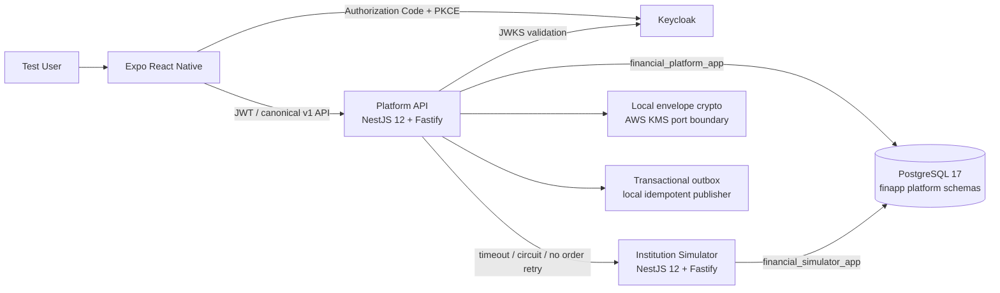
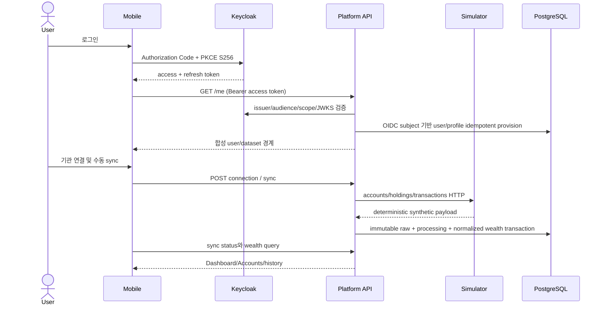
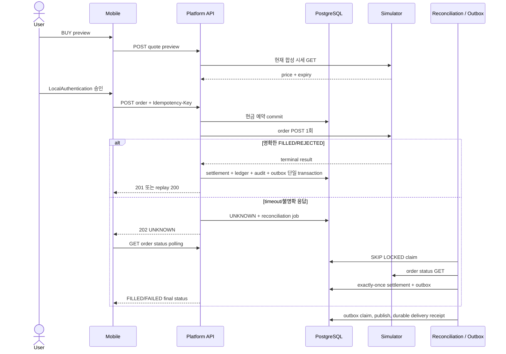

# Portfolio Architecture와 핵심 Sequence

- 상태: DEV-0014 local hardening 최종 문서
- 범위: 합성 데이터 기반 local/Testcontainers/Docker Compose
- 기준 계약: canonical OpenAPI 35 operations / 38 fixtures

## 1. 시스템 구조

모바일은 platform API만 소비하고 DB나 simulator에 직접 접근하지 않는다. platform과 simulator는 process, HTTP 계약, DB role, schema와 migration history를 분리한다. 모든 애플리케이션 소유 DB 객체는 `finapp_` prefix를 사용한다.

| 경계 | 책임 | 강제 수단 |
|---|---|---|
| Mobile | OIDC session, App Lock, 화면과 server/client state 분리 | Expo Router, TanStack Query, Zustand, strict response mapper |
| Platform API | 사용자 소유권, sync/wealth/simulation/trading, transaction과 recovery | Nest feature module, ports/adapters, Drizzle transaction, architecture gate |
| Simulator | deterministic institution data, market/order failure scenario | 별도 Nest service, HTTP-only integration, 독립 role/schema |
| PostgreSQL | raw/derived/ledger/outbox/audit/security event의 영속 경계 | forward migration, constraints, append-only grants, Testcontainers |
| Crypto | field envelope와 deterministic lookup 경계 | AES-256-GCM `FAE2`, canonical AAD, local/AWS provider port |

## 2. 인증과 동기화 Sequence

access token은 메모리에, refresh token은 SecureStore에 둔다. 401 refresh는 single-flight이며 실패하면 session과 Query cache를 함께 지운다. 실제 금융기관이나 실제 개인정보는 이 흐름에 들어오지 않는다.

## 3. BUY, UNKNOWN 복구와 Outbox Sequence

외부 HTTP 호출 중 DB transaction을 열어두지 않는다. 주문 POST는 자동 retry하지 않으며, 같은 idempotency key/payload는 단일 주문을 replay하고 다른 payload는 409로 거부한다. outbox publisher는 lease/backoff/max-attempt와 `(event, consumer)` delivery uniqueness로 중복 효과를 억제한다.

## 4. 보안과 운영 경계

- platform은 JWT signature, issuer, audience, 시간과 scope를 검증한 뒤 URL/body가 아닌 verified subject로 owner를 정한다.
- 다른 사용자 resource는 존재 노출을 줄이기 위해 `404 RESOURCE_NOT_FOUND`로 응답한다.
- full synthetic external identifier는 `FAE2` envelope로 암호화하고 lookup은 HMAC으로 분리한다. wrong AAD/tamper/profile mismatch는 fail-closed다.
- 일반 HTTP log는 method, query-free path, status, duration과 안전한 trace ID만 허용한다. token/header/body/query/raw IP/subject는 받지 않는다.
- authn/authz 실패는 raw IP 대신 keyed hash와 stable reason만 append-only security event에 저장한다.
- audit, security event와 outbox delivery는 runtime UPDATE/DELETE를 금지한다.
- readiness는 bounded DB probe만 필수로 보고, simulator는 circuit breaker로 격리한다. private metrics에는 업무 금액이나 resource ID가 없다.
- production module에는 developer scenario/reset controller와 provider를 등록하지 않는다.

## 5. 검증 가능한 품질 Gate

| Gate | 증거 |
|---|---|
| 계약 | OpenAPI lint, controller 양방향 coverage, provider schema, consumer fixture, compatibility baseline |
| 구조 | mobile dependency rule, 두 backend dependency-cruiser, strict TypeScript |
| 데이터 | 빈 PostgreSQL migration 10개, prefix/role/append-only 권한, transaction/concurrency tests |
| 기능 | OIDC actual smoke와 12단계 sync/simulation/order/reconciliation smoke |
| 보안 | secret scan, auth ownership, log redaction, wrong AAD, production developer route 404 |
| 성능 | runtime role actual JSON plans, expected `finapp_` index와 local 100ms ceiling |
| 배포물 | 두 production image build와 runtime dependency audit 0 |

이 증거는 로컬 합성 환경에 한정된다. 원격 DB, 실제 AWS KMS, HTTPS/EAS Preview와 실제 기기 검증은 수행하지 않았다.
