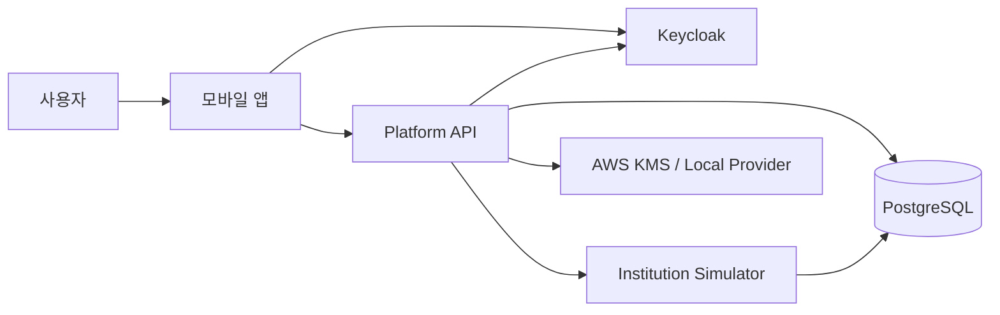

# 보안 모델

- 상태: MVP 실행 기준선
- 작성일: 2026-09-01

이 프로젝트는 합성 데이터만 사용하지만 production-style 보안 경계를 구현한다. 금융규제 준수나 보안 인증을 주장하지 않는다.

## 1. 신뢰 경계



- 모바일은 신뢰할 수 없는 client로 취급한다.
- platform-api만 platform domain을 변경한다.
- simulator는 실패하거나 잘못된 데이터를 반환할 수 있는 외부기관으로 취급한다.
- DB 권한이 service 경계를 강제한다.
- LocalAuthentication 결과는 서버가 신뢰하는 인증 증거가 아니다.

## 2. 인증 흐름

1. 모바일이 Keycloak discovery document를 조회한다.
2. Authorization Code + PKCE S256과 `state`, `nonce`를 사용한다.
3. access token은 메모리에만 둔다.
4. refresh token은 SecureStore에 둔다.
5. API는 JWT signature, issuer, audience, expiration, not-before와 scope를 검증한다.
6. 401 수신 시 refresh를 single-flight로 실행한다.
7. refresh 실패 시 in-memory token과 SecureStore token, Query cache를 제거하고 로그인 화면으로 이동한다.
8. 주문 mutation의 응답이 불명확하면 POST를 재시도하지 않고 order status를 조회한다.

## 3. 생체인증

- 앱이 background에 설정 시간 이상 있었으면 app lock을 표시한다.
- LocalAuthentication 성공은 로컬 UI와 저장된 credential 접근을 허용하는 조건이다.
- 주문 제출 직전 local biometric gate를 한 번 더 수행한다.
- backend는 Face ID/지문 결과를 직접 검증하지 않는다.
- 생체인증 미지원, 미등록, 취소, lockout을 구분한다.
- fallback은 OIDC 재로그인이다.

## 4. 권한 Matrix

| Resource | Scope | 추가 조건 |
|---|---|---|
| `/me` | `financial.read` | token subject mapping |
| connection/sync 생성 | `financial.write` | connection ownership |
| assets/accounts/holdings | `financial.read` | user ownership |
| simulation 생성/조회 | `simulation.execute` | user ownership |
| order preview/submit | `order.execute` | account, quote ownership |
| order 조회 | `financial.read` | user ownership |
| market stock/quote/bars | `market.read` | active catalog; provider credential backend-only |
| dev scenario/reset | `scenario.admin` | demo 환경 전용; production controller/provider 미등록 |

다른 사용자 resource는 `403` 대신 `404 RESOURCE_NOT_FOUND`를 사용해 존재 여부 노출을 줄인다.

## 5. 데이터 분류

| 등급 | 예 | 처리 |
|---|---|---|
| Secret | refresh token, DB password, AWS credential | SecureStore/secret store, 로그 금지 |
| Sensitive synthetic | full external account/customer identifier | DB field encryption, API에는 masked value |
| Internal | user UUID, order ID, trace ID | 필요한 API와 구조화 로그에 제한 사용 |
| Public synthetic | 상품 표시명, dataset version, disclaimer | 앱 표시 가능 |

실제 개인정보와 실제 계좌정보는 어떤 환경에서도 사용하지 않는다.

## 6. 암호화

### local/test

- `LocalDataKeyProvider`가 random 256-bit DEK를 만들고 local KEK로 AES-256-GCM wrapping
- `FAE2` versioned envelope에 wrapped DEK, field IV/tag와 ciphertext를 저장해 production KMS 구조와 같은 경계를 유지
- owner/schema/table/column/scope를 canonical AAD로 field와 wrapped DEK 양쪽에 적용
- test key를 demo/production에 사용하지 않음

### demo/production

- AWS KMS symmetric key
- AES-256-GCM data encryption key
- encrypted DEK, IV, algorithm, key version, AAD metadata 저장
- AAD에 app, user, table, column, record ID 포함
- plaintext DEK는 메모리에서만 짧게 사용

KMS integration은 Milestone 6이며 원격 권한 확인 전에 실행하지 않는다.

BE-0013의 `AwsKmsDataKeyProvider`는 `GenerateDataKey`, encryption-context `Decrypt`, 별도 HMAC key `GenerateMac` client port를 구현하고, backend의 AWS SDK adapter가 이를 KMS 명령으로 매핑한다. 단위 test는 fake client만 사용하며 실제 AWS credential, key policy와 원격 KMS roundtrip은 별도 remote 검증 단계로 둔다. local provider는 `demo`/`production` bootstrap과 operation에서 fail-closed한다. 기존 `FAE2` 이전 ciphertext read는 합성 local/test에서만 허용하고 demo/production에서는 거부한다.

## 7. 로그와 감사

일반 application log, audit event, security event를 구분한다.

BE-0014 기준 일반 HTTP log는 JSON line의 timestamp/level/event/requestId/correlationId/method/query-free path/statusCode/durationMs만 출력한다. Authorization/cookie/header, body, query string과 principal subject는 logger 입력에 포함하지 않는다. trace header는 길이와 안전 문자 allowlist를 통과하지 않으면 server-generated request ID로 교체한다.

인증·인가 실패는 `finapp_security_event`에 append-only 기록한다. raw source IP 대신 별도 local HMAC key의 SHA-256 결과를 사용하고 token/subject/전체 scope는 저장하지 않는다. Security event DB 저장 실패가 발생해도 요청은 계속 거부되며 인증 우회로 전환되지 않는다.

로그 금지:

- access/refresh token
- Authorization header
- DB password와 KMS credential
- full 계좌/고객 identifier
- raw request/response body 전체
- encryption plaintext와 data key

필수 audit action:

```text
MYDATA_CONNECTION_CREATED
MYDATA_SYNC_STARTED
MYDATA_SYNC_COMPLETED
SIMULATION_EXECUTED
ORDER_CREATED
ORDER_SUBMITTED
ORDER_RECONCILED
ORDER_FILLED
AUTH_SESSION_EXPIRED
ACCESS_DENIED
DEV_SCENARIO_CHANGED
```

metadata는 allowlist 방식으로 추가한다.

BE-0010 기준 `finapp_audit_event`는 runtime role에 SELECT/INSERT만 허용하고 UPDATE/DELETE를 거부한다. order audit은 settlement transaction 안에서 기록하며 connection/sync/simulation/developer action도 resource UUID 또는 null, synthetic flag와 상태/mode 같은 allowlist metadata만 저장한다. token, full external identifier, request/response body와 암호화 plaintext는 audit metadata에 저장하지 않는다.

## 8. 환경 보호

- local Keycloak `start-dev`는 local에서만 사용한다.
- local OIDC test user는 합성 이름과 `.invalid` email만 사용하고 password는 실행 시
  환경변수로만 주입하며 source, fixture, log에 저장하지 않는다.
- demo Keycloak은 production mode, PostgreSQL, HTTPS를 사용한다.
- simulator와 admin endpoint는 public reverse proxy에 등록하지 않는다.
- production module에는 developer controller와 reset provider를 등록하지 않는다.
- CORS origin과 redirect URI는 환경별 allowlist다.
- `.env`, keystore, certificate private key는 Git에서 제외한다.

## 9. MVP 보안 검증

- valid/expired/wrong issuer/wrong audience token
- missing scope
- 다른 사용자 account/order/simulation 접근
- production profile dev endpoint 404
- risk profile URL/body에 user ID를 받지 않고 verified OIDC owner만 접근하며 PUT은 `financial.write`와 optimistic version을 요구
- planning preference는 합성 데이터만 사용하고 recommendation/suitability 판단이나 실제 개인정보를 저장하지 않음
- 로그 token/full identifier 검색 실패
- refresh 실패 후 cache와 token 제거
- 잘못된 AAD decrypt 실패
- authn/authz 실패 security event의 token/raw IP 비노출과 UPDATE/DELETE 거부
- structured HTTP log에서 query/header/body/token 문자열 부재
- platform role의 `finapp_simulator` schema SELECT 실패
- simulator role의 `finapp_*` platform schema SELECT 실패
