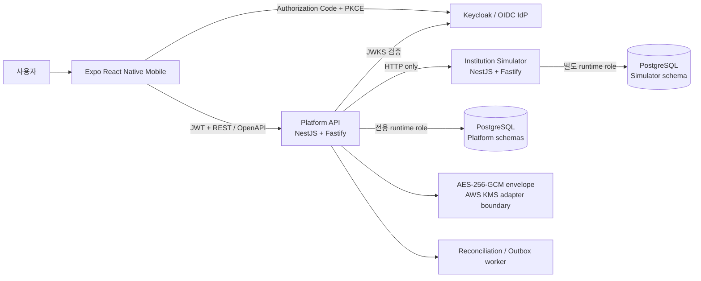
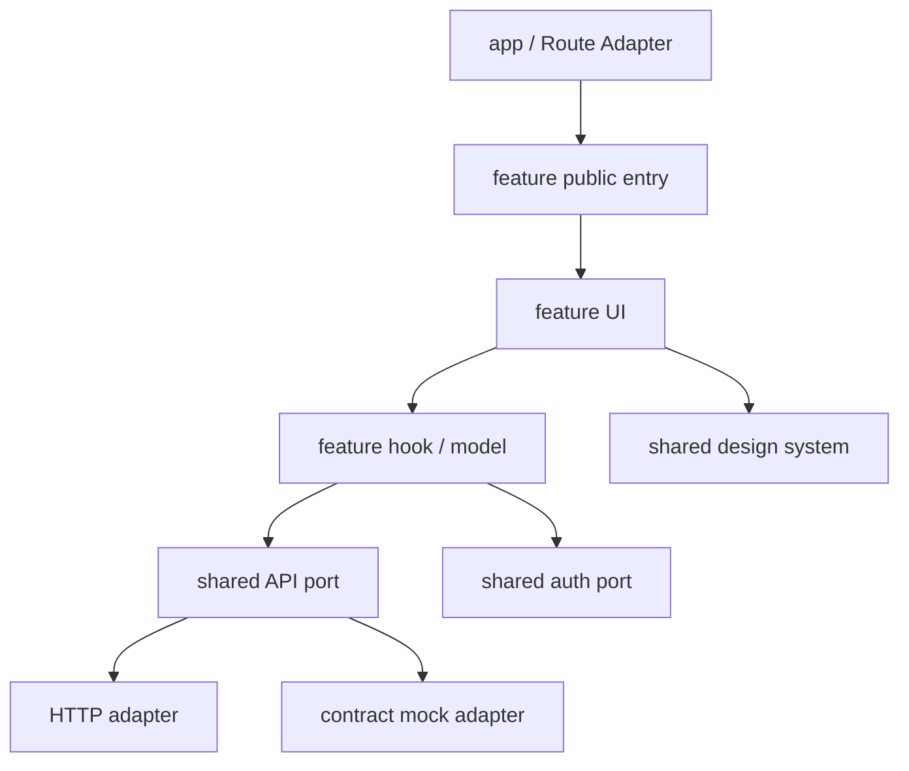
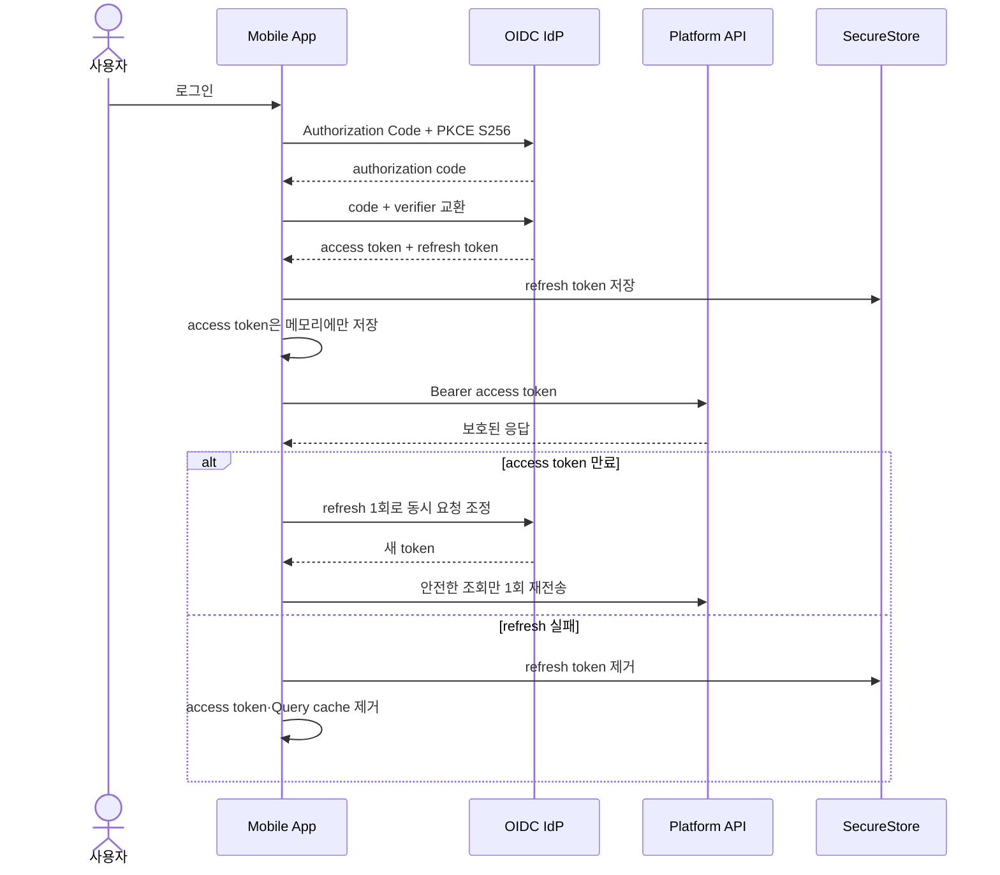
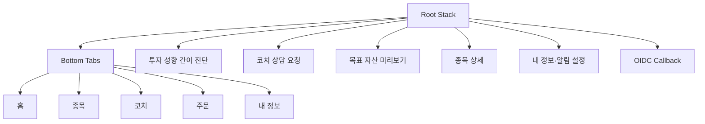
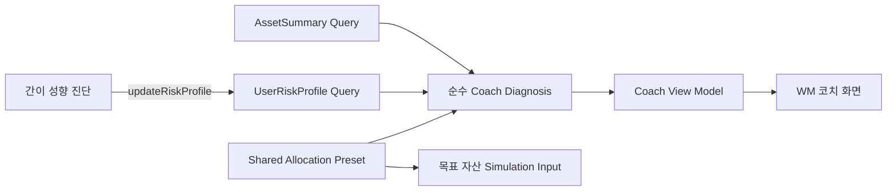
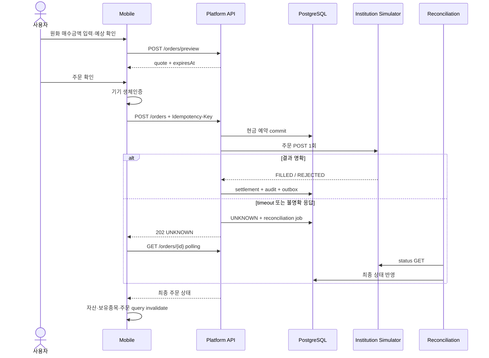

# Wealth Flow

## 모바일 앱 프론트 포트폴리오 기술 구성서

> 프로젝트 성격: 합성 금융 데이터 기반 iOS·Android 크로스플랫폼 ReactNative
> 설명 범위: 모바일 프론트엔드 중심, 연동 서버 아키텍처 포함  


---

## 1. 프로젝트 요약

Wealth Flow는 자산 통합 조회, 투자 성향 기반 예시 코치 진단, 실제 KIS 국내 주식 시세, 목표 자산 시뮬레이션, 매수 주문과 장애 복구 흐름을 하나의 모바일 앱에서 보여 주는 금융 플랫폼 포트폴리오입니다. React Native와 Expo를 기반으로 iOS·Android 공통 코드를 구성하고, 모바일이 직접 데이터베이스나 외부 기관에 접근하지 않도록 Node.js Platform API를 단일 진입점으로 두었습니다.

이 프로젝트에서 가장 중요하게 다룬 문제는 화면 수 자체보다 다음과 같은 금융 모바일 앱의 경계입니다.

- 서버 상태, 입력 상태, 인증 상태와 앱 잠금 상태를 서로 다른 수명주기로 관리합니다.
- 액세스 토큰은 메모리, 갱신 토큰은 OS 보안 저장소에 두고 세션 종료 시 사용자별 캐시를 함께 제거합니다.
- 주문과 같은 비멱등 요청은 인증 갱신 뒤 자동 재전송하지 않으며, Idempotency Key와 조회 기반 복구를 사용합니다.
- 차트는 Skia 기반 렌더링과 Reanimated를 사용하고, 시스템의 모션 감소 설정과 접근성 레이블을 함께 반영합니다.
- 화면, 기능, 공통 기술 코드의 의존 방향을 CI에서 검사해 기능 증가에 따른 구조 붕괴를 방지합니다.
- API 명세, 모바일 mock, 실제 서버 응답을 같은 OpenAPI 계약으로 검증합니다.
- 코치 결과는 합성 자산과 planning preference를 결정적 client 규칙으로 연결해 결과의 재현성과 설명 가능성을 확보했습니다.

사용자·계좌·거래 데이터는 재현 가능한 합성 데이터로 구성하고, 주식 시세·차트 데이터는 한국투자증권(KIS) API를 연동합니다. 로컬 인수 검증에서는 동일한 인터페이스의 deterministic local provider를 사용해 외부 의존성 없이 재현합니다.

## 2. 지원 직무와의 기술 접점

| 채용 직무의 핵심 요구 | 프로젝트에서 적용한 내용 | 검증 상태 |
|---|---|---|
| React Native·TypeScript·Expo | React Native 0.86, TypeScript strict, Expo SDK 57 기반 단일 앱 | 구현·자동 검증 완료 |
| 앱 아키텍처 | feature-first 구조, route adapter, public entry, 순환 의존 금지 | 244개 소스 파일 구조 검사 통과 |
| 상태 관리 | TanStack Query로 서버 상태, Zustand로 화면 초안·앱 잠금·표시 설정 관리 | 구현·단위 테스트 완료 |
| 네비게이션 | Expo Router의 Stack·Tabs·동적 route와 typed routes 적용 | 16개 필수 route smoke 통과 |
| 웹/모바일 전환 표준 | React Native primitive, 디자인 토큰, 공통 컴포넌트, 필요한 경우 플랫폼별 파일 분리 | Web export 및 Android 화면 검증 이력 |
| 생체인증 | `expo-local-authentication`을 포트 뒤에 격리하고 앱 잠금·주문 승인에 적용 | Android Emulator 및 어댑터 테스트 완료 |
| Keychain·Keystore 토큰 보관 | `expo-secure-store`, `WHEN_UNLOCKED_THIS_DEVICE_ONLY`, access/refresh token 저장 위치 분리 | 구현·테스트 완료 |
| 세션 만료·재인증 | PKCE 로그인, single-flight refresh, 안전한 메서드만 1회 replay, 실패 시 세션·Query cache 제거 | 구현·테스트 완료 |
| 모바일 차트·Reanimated | Victory Native, React Native Skia, Reanimated, Gesture Handler | 종목·자산·시뮬레이션 차트 구현 |
| 온보딩·금융 산출 화면 | 최초 실행, 본인확인·PIN 설정 UI, 권한 요청, 자산→성향→진단→제안 비교→simulation/상담 흐름 | Android 포트폴리오 흐름 검증 |
| REST API 협업 | canonical OpenAPI, 엄격한 runtime response mapper, contract mock | 38 operations·41 fixtures 검증 |
| 테스트·CI | Vitest, Testing Library, architecture/route/design gate, GitHub Actions | 모바일 65 files·209 tests 통과 |

## 3. 전체 시스템 아키텍처



### 3.1 배포·신뢰 경계

| 경계 | 책임 | 핵심 결정 |
|---|---|---|
| Mobile | 사용자 상호작용, 로컬 보안, 화면 상태, 서버 상태 표현 | Platform API만 소비하고 DB·기관 Simulator에는 직접 접근하지 않음 |
| Platform API | 인증된 사용자 소유권, 금융 업무 규칙, 트랜잭션, 외부 연동 복구 | NestJS 모듈형 모놀리스와 ports/adapters 적용 |
| Institution Simulator | 합성 계좌·보유자산·주문 및 장애 시나리오 | 별도 프로세스·DB role·schema·migration으로 분리 |
| PostgreSQL | 원본·파생 데이터, 주문 원장, job, outbox, 감사 이벤트 | constraint와 transaction을 최종 정합성 경계로 사용 |
| OIDC IdP | 사용자 인증과 토큰 발급 | 모바일은 PKCE, API는 issuer·audience·scope·JWKS 검증 |

MVP 규모에서는 기능마다 서비스를 분리하는 대신 Platform API를 모듈형 모놀리스로 구성했습니다. 변경 원자성과 로컬 재현성을 유지하면서도 외부 기관 Simulator만 별도 서비스로 분리해 네트워크 장애, 지연과 불명확한 주문 응답을 실제 HTTP 경계에서 검증할 수 있게 했습니다.

### 3.2 주요 사용자 흐름

1. 최초 실행 안내와 선택 권한 요청을 거쳐 로컬 포트폴리오 접근을 설정합니다.
2. 재실행 시 기기 생체인증으로 앱 잠금을 해제합니다.
3. 실제 HTTP 모드에서는 OIDC Authorization Code + PKCE로 로그인합니다.
4. 자산 연결·동기화 후 Dashboard, 계좌, 보유종목과 거래내역을 조회합니다.
5. 국내 주식 검색, 현재가와 기간별 차트를 확인합니다.
6. 자산과 투자 성향을 함께 조회해 결정적 규칙으로 현재 배분 진단과 예시 제안 배분을 비교합니다.
7. 간이 진단으로 성향을 변경하면 코치 진단과 제안 배분을 즉시 다시 파생합니다.
8. 같은 제안 배분으로 목표 simulation을 실행하거나 화면 로컬 상담 요청을 완료합니다.
9. 주문 미리보기 후 생체인증을 거쳐 매수를 요청하고, 불명확한 응답은 상태 조회로 복구합니다.

6~8의 코치 흐름은 같은 입력에 같은 결과를 제공하는 client-side deterministic portfolio experience입니다.

---

# Part A. 모바일 애플리케이션

## 4. 모바일 기술 구성

| 분류 | 기술 | 적용 목적 |
|---|---|---|
| Language | TypeScript 6, strict mode | route·상태·API 계약의 정적 안전성 |
| UI Runtime | React 19, React Native 0.86 | iOS·Android 공통 UI와 native primitive |
| App Platform | Expo SDK 57, Expo Development Build | 네이티브 모듈 포함 개발·빌드 기반 |
| Navigation | Expo Router 57 | file-based routing, Stack·Tabs, deep link callback |
| Server State | TanStack Query 5 | 캐시, 요청 수명주기, invalidation, polling |
| Client State | Zustand 5 | 시뮬레이션 초안, 금액 표시, 앱 잠금 상태 |
| Derived Planning | 순수 TypeScript model, React `useMemo` | 합성 자산과 성향에서 코치 진단·예시 배분 파생 |
| Chart | Victory Native 42, React Native Skia 2.6 | GPU 가속 금융 시계열 렌더링 |
| Motion·Gesture | Reanimated 4, Gesture Handler 2 | 차트 상호작용, 모션 감소 대응 |
| Auth | Expo AuthSession | OAuth2/OIDC Authorization Code + PKCE |
| Local Security | LocalAuthentication, SecureStore | Face ID·지문, Keychain·Keystore-backed 저장 |
| Device Integration | Network, Notifications, Camera, Image Picker, Device | 연결 상태와 선택 권한, 기기별 인증 경로 |
| Test | Vitest 4, Testing Library React Native | 상태·adapter·hook·screen component 검증 |
| Quality Gate | ESLint, TypeScript, custom architecture/route/design checks | 구조·route·디자인 규칙의 자동 강제 |

## 5. 모바일 아키텍처

### 5.1 Feature-first와 route adapter

```text
apps/mobile/src/
├── app/                         # Expo Router: URL·화면 조합만 담당
│   ├── _layout.tsx             # 전역 provider와 접근 경계 조합
│   ├── (tabs)/                 # 홈·종목·코치·주문·내 정보
│   ├── coach-risk-check.tsx    # 투자 성향 간이 진단
│   ├── coach-consultation.tsx  # 화면 로컬 상담 요청
│   ├── plan.tsx                # 코치 제안 배분 기반 목표 미리보기
│   ├── market/[symbol].tsx     # 종목 상세 동적 route
│   └── oauth/callback.tsx      # OIDC redirect 진입점
├── features/                   # 업무 기능 단위
│   ├── launch/                 # 최초 실행·선택 권한
│   ├── onboarding/             # 소개·본인확인 UI·PIN 설정
│   ├── app-lock/               # 생체인증 잠금과 background lifecycle
│   ├── login/                  # 실제 OIDC·local portfolio 조합
│   ├── wealth/                 # 자산 통합 조회·동기화
│   ├── coach/                  # 진단·간이 성향 진단·상담 demo
│   ├── market/                 # 종목 검색·현재가·기간별 차트
│   ├── simulation/             # 입력 초안·서버 계산·결과 차트
│   ├── order/                  # quote·생체승인·주문·복구 polling
│   └── settings/               # 내 정보·알림 설정
└── shared/
    ├── api/                    # PlatformApi port, HTTP·mock adapter, mapper
    ├── auth/                   # 세션·OIDC·SecureStore·biometric port
    ├── query/                  # QueryClient와 native lifecycle 연결
    ├── design-system/          # token과 재사용 UI component
    ├── planning/               # 성향별 예시 배분 preset
    ├── privacy/                # 금액 숨김 같은 횡단 표시 상태
    └── format/                 # 원화·수량·일자·시세 표현
```

route 파일은 비즈니스 로직을 갖지 않고 기능의 public `index.ts`를 통해 화면을 조합합니다. 기능 간 직접 import도 허용하지 않습니다. 공유 계층이 기능이나 route를 역으로 참조하지 않도록 해 의존 방향을 단순하게 유지했습니다.



자동 구조 검사는 다음을 실패로 처리합니다.

- `shared`가 `features` 또는 `app`을 import하는 경우
- 한 feature가 다른 feature의 내부 파일을 직접 import하는 경우
- route가 feature의 public entry를 우회하는 경우
- route가 API transport 내부 구현을 직접 사용하는 경우
- 소스 import cycle이 생기는 경우

이 규칙은 아키텍처 문서에만 머물지 않고 `npm run architecture:check -w @finapp/mobile`로 CI에서 실행됩니다.

### 5.2 전역 조합과 접근 경계

앱 최상단은 provider와 보안 경계의 순서를 명시합니다.

```text
SafeAreaProvider
└── AuthSessionProvider
    └── PortfolioAccessProvider
        └── AppLaunchBoundary
            └── PortfolioAccessBoundary
                └── LoginBoundary
                    └── ConfiguredPlatformApiProvider
                        └── MobileQueryProvider
                            └── Expo Router Stack / Tabs
```

이 순서로 얻는 효과는 다음과 같습니다.

- 최초 실행·권한·앱 잠금이 업무 화면보다 먼저 평가됩니다.
- 인증 세션이 결정된 뒤 해당 세션의 API adapter와 Query cache가 생성됩니다.
- 로그아웃이나 refresh 실패로 세션이 사라지면 Query cache도 즉시 제거됩니다.
- 화면은 OIDC, SecureStore, fetch 구현을 직접 알지 않고 `PlatformApi`와 auth context만 사용합니다.

포트폴리오 기본 시연 모드는 실제 인증 서버 없이 contract mock으로 화면을 탐색할 수 있습니다. 별도의 HTTP 모드에서는 같은 화면이 OIDC와 실제 Platform API를 사용합니다. 이는 인증 장애가 UI 리뷰를 막지 않게 하는 데모 전략이며, mock 응답도 canonical 계약 fixture를 통과해야 합니다.

## 6. 상태 관리 설계

모든 상태를 하나의 전역 store에 넣지 않고 소유권과 수명주기로 나눴습니다.

| 상태 종류 | 소유 기술 | 대표 상태 | 정책 |
|---|---|---|---|
| 서버 상태 | TanStack Query | 자산, 투자 성향, 종목, 시뮬레이션 결과, 주문 | query key, stale time, abort signal, invalidation |
| 파생 코치 상태 | 순수 함수 + `useMemo` | 진단, 현재/제안 배분과 문구 | 저장하지 않고 자산·성향 응답에서 매번 파생 |
| 화면 로컬 상태 | React `useState` | 간이 진단 답변·결과 표시, 상담 선택·완료 | 화면 이탈 시 폐기, 서버·전역 store에 복제하지 않음 |
| 화면 초안 | Zustand | 기간·목표 금액·월 납입액 | 입력 중 route 이동에도 보존, 제출 결과와 분리 |
| 보안 UI 상태 | Zustand vanilla store | locked·unlocking·unlocked·reauthentication-required | 명시적 상태 전이와 중복 인증 방지 |
| 개인정보 표시 상태 | Zustand | 금액 보이기·숨기기 | 숫자와 차트 접근성 문구에 함께 적용 |
| access token | 메모리 store | API Bearer token | 프로세스 종료 시 소멸 |
| refresh token | Expo SecureStore | 세션 복구 토큰 | 기기 전용, 잠금 해제 후 접근 가능 |
| 최초 실행 marker | Expo SecureStore | 안내·권한·설정 완료 여부 | 재실행 시 중복 온보딩 방지 |
| route 상태 | Expo Router | tab, full-screen, symbol parameter | URL과 navigation stack이 소유 |

### 6.1 TanStack Query의 모바일 수명주기 연결

- `AppState`가 active일 때만 Query focus 상태로 간주합니다.
- `expo-network` 이벤트를 Query online manager와 연결합니다.
- query는 기본 30초 stale time, 5분 garbage collection을 사용합니다.
- 오류가 `retryable`로 분류된 조회만 최대 2회 시도합니다.
- mutation은 기본 자동 retry를 금지합니다.
- 모든 주요 조회는 `AbortSignal`을 HTTP adapter로 전달해 화면 전환·요청 취소를 지원합니다.
- 동기화 완료, 주문 체결처럼 서버의 기준 상태가 바뀌는 순간 관련 query key만 선택적으로 invalidate합니다.

### 6.2 금융 mutation의 재전송 원칙

조회와 주문의 재시도 정책을 구분했습니다.

```text
GET/HEAD/OPTIONS + 401
→ refresh token으로 single-flight 갱신
→ 안전한 요청만 새 access token으로 1회 replay

POST/PUT + 401
→ access token은 갱신할 수 있으나 원 요청은 자동 replay하지 않음
→ 사용자가 결과를 확인하거나 명시적으로 다시 수행
```

주문 생성은 네트워크 오류만으로 같은 POST를 반복하지 않습니다. 모바일은 action마다 UUID Idempotency Key를 생성하고, 서버는 같은 key·같은 payload만 기존 주문으로 응답합니다. 전송 결과가 불명확하면 새 주문을 만들지 않고 주문 GET polling으로 최종 상태를 확인합니다.

## 7. 인증·생체인증·네이티브 보안 경계

### 7.1 OIDC 세션



주요 보안 결정:

- Expo AuthSession의 discovery와 Authorization Code + PKCE S256을 사용합니다.
- access token은 디스크에 저장하지 않습니다.
- refresh token은 `WHEN_UNLOCKED_THIS_DEVICE_ONLY` 옵션으로 SecureStore에 저장합니다.
- 동시에 여러 API가 401을 받더라도 refresh promise 하나만 공유합니다.
- 잘못되거나 비어 있는 token은 저장하기 전에 거부합니다.
- 세션 복원 실패는 인증됨으로 간주하지 않고 `unavailable` 또는 `absent` 상태로 분리합니다.
- 세션 종료 시 사용자별 Query cache도 제거해 다음 사용자에게 데이터가 남지 않게 합니다.

### 7.2 생체인증과 앱 잠금

네이티브 API를 화면에서 직접 호출하지 않고 `BiometricGate` port와 Expo adapter로 분리했습니다. 따라서 테스트에서는 결정적인 fake를 사용하고, 실제 기기에서는 LocalAuthentication adapter를 주입합니다.

- 하드웨어 존재와 생체정보 등록 여부를 먼저 확인합니다.
- 강한 생체인증 수준을 요청하고 device credential fallback은 비활성화합니다.
- 성공, 사용자 취소, 일시 실패, timeout, 미등록, lockout과 시스템 오류를 서로 다른 상태로 매핑합니다.
- background 진입 시각을 기록하고 60초 이상 지난 뒤 active가 되면 다시 잠급니다.
- 주문 확정 직전에도 별도의 biometric gate를 통과해야 합니다.
- 생체정보 자체는 앱이나 서버에 저장하지 않습니다.

포트폴리오 최초 접근을 위한 로컬 생체인증과 OIDC 서버 인증은 목적과 수명주기가 다른 보안 경계로 분리했습니다.

간편비밀번호 화면은 숫자 배열을 매번 섞는 6자리 생성·확인 interaction과 불일치 재입력 흐름으로 구성했습니다.

### 7.3 권한 요청

알림, 사진과 카메라 권한은 최초 실행 설명 뒤 순차 요청합니다.

- 이미 결정된 권한은 다시 요청하지 않습니다.
- 하나의 adapter 오류나 사용자 거부가 나머지 온보딩을 막지 않습니다.
- Android 13 이상 알림 prompt를 위해 notification channel을 먼저 생성합니다.
- 권한 처리 marker를 보안 저장소에 기록해 매 실행마다 prompt를 반복하지 않습니다.
- iOS usage description과 Android biometric permission을 app config에 선언합니다.

## 8. 네비게이션과 화면 구성

### 8.1 Route 구조

| Route | 화면 역할 |
|---|---|
| `/(tabs)` | 홈·종목·코치·주문·내 정보의 공통 상·하단 navigation |
| `/coach-risk-check` | 투자 성향 간이 진단과 기존 profile 갱신 |
| `/coach-consultation` | Calendar·날짜별 시간 slot·방식을 선택하는 화면 로컬 상담 demo |
| `/plan` | 현재 성향의 예시 배분을 사용하는 목표 자산 미리보기 |
| `/market/[symbol]` | 종목별 현재가·기간별 OHLC 차트 |
| `/order` | 선택 종목에서 진입하는 매수 흐름 |
| `/my-info-management` | 투자 성향·월 납입액 관리 full-screen page |
| `/notification-settings` | 알림 설정 full-screen page |
| `/notifications` | 알림함 |
| `/oauth/callback` | OIDC redirect callback |

### 8.2 Root Stack과 Bottom Tabs의 책임 분리



주 탐색과 집중 작업의 navigation 계층을 분리했습니다. 홈·종목·코치·주문·내 정보에는 공통 WM 상단바와 5개 Bottom Tabs를 유지하고, 진단·상담·시뮬레이션·설정처럼 완료 후 이전 맥락으로 돌아가야 하는 화면은 Root Stack의 card route로 구성했습니다. Stack 화면은 공통 `FullScreenPage`를 사용해 safe area, 64px header, 중앙 제목과 뒤로가기를 일관되게 제공합니다.

기존 `플랜` 탭을 `코치` 탭으로 재구성할 때 목표 자산 시뮬레이션을 삭제하지 않고 `/plan` 후속 화면으로 이동했습니다. 이를 통해 핵심 기능은 보존하면서 정보 구조를 “계산 도구 진입”에서 “자산 진단 후 다음 행동 선택” 중심으로 변경했습니다.

### 8.3 Route Adapter와 deep link

route 파일은 화면 구현이나 업무 로직을 소유하지 않습니다. feature의 public entry에서 screen을 가져오고 `router.push`, `router.back` 같은 navigation 동작만 callback prop으로 전달합니다.

```text
Expo Router Route
→ 경로 parameter 정규화
→ navigation callback 구성
→ Feature Screen에 명시적 prop으로 전달
```

이 구조에서는 feature screen이 Expo Router에 직접 의존하지 않으므로 navigation을 mock하지 않고도 CTA, 저장 성공과 뒤로가기 동작을 component test에서 검증할 수 있습니다. Route는 feature 내부 파일을 우회해 import할 수 없으며 architecture gate가 public entry 사용 여부를 검사합니다.

- `/market/[symbol]`은 `string | string[]` 형태로 들어올 수 있는 동적 parameter를 route 경계에서 단일 symbol로 정규화합니다.
- `/oauth/callback`은 OIDC redirect를 받는 별도 deep-link 진입점으로 유지합니다.
- 코치 화면은 진단·상담·목표 확인 callback을 각각 `/coach-risk-check`, `/coach-consultation`, `/plan`과 연결합니다.
- 저장이나 상담 완료 뒤에는 `router.back()`을 사용해 사용자가 진입한 코치 맥락으로 복귀합니다.

### 8.4 탭 상호작용과 화면 수명주기

- 탭 화면은 `lazy: true`로 설정해 사용자가 방문하기 전에는 불필요한 화면 tree를 생성하지 않습니다.
- `screenLayout`에서 홈·종목·코치·주문 탭을 `FirstVisitTabSkeletonGate`로 감싸고 앱 session의 최초 방문에만 skeleton을 표시합니다.
- skeleton이 보이는 동안 실제 content는 유지하되 opacity, pointer event와 accessibility descendant를 차단합니다. 로딩 표현 뒤 실제 화면으로 전환될 때 중복 터치와 스크린리더의 숨은 content 탐색을 방지합니다.
- 탭 선택 이벤트는 `scrollResetRevision`을 갱신하고 공통 `Screen`이 `ScrollView.scrollTo({ y: 0 })`를 실행합니다. 화면을 remount하지 않으므로 입력값과 component local state는 보존하면서 스크롤 위치만 상단으로 복귀합니다.
- 상단바는 알림함 Stack route를 제공하고, 하단 탭은 `tabPress`와 `tabLongPress` 이벤트를 유지합니다.
- 각 탭에 접근성 `tab` role과 선택 상태를 제공하며 아이콘·레이블·최소 touch target을 공통 규칙으로 적용합니다.

### 8.5 Safe area와 navigation chrome

상단바, 화면 content와 하단바가 system inset을 중복으로 소비하지 않도록 소유권을 분리했습니다.

- 탭 상단의 system inset은 공통 header가 담당합니다.
- 하단 inset은 Bottom Bar가 담당하고 탭의 `Screen`은 좌우 inset과 content padding만 적용합니다.
- Root Stack의 전체 화면은 상·하·좌·우 safe area를 직접 처리합니다.
- 화면과 탭을 이동해도 WM 상단바, 알림 진입점과 Bottom Tabs의 시각적 계층을 유지합니다.

app config의 `typedRoutes`를 켜고, 별도의 route smoke script가 필수 route 파일 16개, 탭 레이블, 아이콘과 앱 표시 이름을 검사합니다. 동적 route parameter는 진입 화면에서 정규화하며 route 누락이나 정보 구조 회귀를 CI에서 탐지합니다.

### 8.6 웹·모바일 공통 UI 규칙

- View, Text, Pressable, ScrollView 같은 React Native primitive를 기본으로 사용합니다.
- 색상, 간격, radius, shadow, typography, motion을 디자인 토큰으로 관리합니다.
- route와 feature UI에서 raw hex color 사용을 금지합니다.
- 화면에 개발 용어, 인증 방식과 mock 구현 세부가 노출되지 않도록 고객 문구 검사를 둡니다.
- safe area 소유권을 상단바, 화면과 하단바 사이에 명확히 나눠 중복 여백을 방지합니다.
- native와 web 구현 차이가 필요한 경우 `.web.tsx` adapter를 사용합니다.
- 44~48px 이상의 touch target, 접근성 role·label·state와 live region을 적용합니다.
- 시스템의 모션 감소 설정을 확인해 차트 animation을 비활성화할 수 있습니다.

디자인 시스템 검사는 현재 51개 UI 파일을 대상으로 raw color와 금지된 기술 문구를 확인합니다.

## 9. 주요 모바일 기능

### 9.1 자산 Dashboard와 MyData 동기화

자산 요약, 계좌, 보유종목, 거래내역과 자산 추이를 각각 독립 query로 조회합니다. 일부 query가 갱신 중이어도 기존 데이터가 있으면 전체 화면을 loading으로 되돌리지 않습니다.

- 연결 생성과 sync 시작은 mutation으로 분리합니다.
- sync가 terminal 상태가 될 때까지 짧은 polling을 수행합니다.
- 완료 시 summary·accounts·holdings·history·transactions query만 invalidate합니다.
- 계좌번호는 서버에서 마스킹된 값만 받고 모바일 runtime mapper도 마스킹 형태를 확인합니다.
- 금액 숨김 설정은 숫자뿐 아니라 차트의 접근성 설명에도 적용합니다.

### 9.2 국내 주식 검색과 종목 차트

- 입력값은 300ms debounce 후 검색합니다.
- 종목 검색, 현재가와 interval별 bars에 서로 다른 query key와 stale time을 사용합니다.
- 분·일·주·월·년 interval을 지원하고 데이터는 시간순 point로 정규화합니다.
- 현재가·전일대비·등락률·거래량과 OHLC tooltip을 제공합니다.
- 한국 시장 관례에 맞춰 상승은 적색, 하락은 청색 계열 token을 사용합니다.
- 실제 chart press 값을 Reanimated shared value로 받고 선택 시각만 React state로 전달합니다.

### 9.3 WM 코치와 투자 성향 연결

코치 탭은 기존 API의 합성 `AssetSummary`와 planning preference인 `UserRiskProfile`을 병렬 조회해 “현재 자산 → 성향 → 진단 → 예시 배분 → 목표 확인” 흐름으로 연결합니다. 기존 자산·성향·simulation 계약과 Query cache를 재사용하는 mobile composition으로 구성했습니다.

#### 9.3.1 모바일 파생 모델



진단 규칙은 React component 밖의 순수 TypeScript model에 둡니다.

1. `AssetSummary.allocation`을 현금·채권·주식으로 정규화하고 누락 자산군은 0으로 처리합니다.
2. 안정형 20/50/30, 균형형 10/30/60, 성장형 5/15/80 예시 배분을 shared planning source에서 가져옵니다.
3. 현재 비중과 예시 배분의 차이를 percentage point로 계산합니다.
4. 절댓값 차이가 가장 큰 자산군을 대표 인사이트로 선택합니다. 동률은 주식→채권→현금 순으로 결정합니다.
5. 최대 차이가 5%p 이하면 `ALIGNED`, 초과하면 `NEEDS_ATTENTION`으로 분류하고 `OVER`·`UNDER` 방향을 함께 만듭니다.
6. 화면은 계산식을 재구현하지 않고 model이 반환한 headline, 설명과 비교 view model만 렌더링합니다.

기본 합성 데이터에서는 균형형 기준 현재 주식 비중 약 92%와 예시 60%의 차이를 계산해 “균형형 기준보다 주식 비중이 32%p 높아요.”라는 인사이트를 만듭니다. 이 숫자는 UI에 하드코딩하지 않고 API 응답과 순수 계산 결과에서 파생합니다.

#### 9.3.2 상태·캐시 일관성

- 자산 요약은 Dashboard와 같은 `['wealth', 'summary']`, 투자 성향은 Settings와 같은 `['risk-profile']` query key를 재사용합니다.
- 두 query를 병렬 실행하고 최초 loading, cached refreshing, 전체 실패와 cached data가 남은 부분 실패를 서로 다른 화면 상태로 표현합니다.
- 코치 진단은 Query cache나 Zustand에 복제하지 않고 두 응답으로 `useMemo`에서 다시 파생합니다.
- 3문항 간이 진단은 답변·계산 결과를 component local state에만 둡니다. 0~6점 결과를 안정형·균형형·성장형과 36·60·120개월에 매핑합니다.
- 저장 시 기존 `monthlyContribution`을 보존하고 `expectedVersion`을 전달해 optimistic concurrency를 유지합니다.
- 저장 성공 응답은 `['risk-profile']` cache에 즉시 반영하고 `['current-user']`를 invalidate합니다. 코치 화면으로 돌아오면 headline, 비교 배분과 후속 simulation allocation이 같은 성향으로 함께 바뀝니다.
- mutation 중복 submit과 자동 retry를 막고, 저장 실패 시 사용자의 답변과 계산 결과를 유지해 재시도할 수 있게 합니다.

#### 9.3.3 목표 확인과 상담 경계

- 코치 화면과 simulation은 같은 `allocationForRiskProfile` source를 사용합니다. 화면에 표시한 현금·채권·주식 비중을 그대로 `createSimulation` input에 전달합니다.
- profile 조회가 실패한 직접 진입은 균형형 예시 배분을 사용하되 warning으로 fallback 사실을 알립니다.
- 상담 날짜·시간·방식·완료 여부는 화면 `useState`가 소유하며, 선택 요약을 전달하는 local notification demo와 연결했습니다.
- 결정적 규칙 엔진을 사용해 같은 입력에 같은 진단을 제공하며 규칙과 경계값을 단위 테스트로 검증합니다.
- `%p`는 화면에서 유지하되 접근성 label에서는 “퍼센트포인트”로 읽고, 현재·예시 배분 전체를 하나의 접근성 문장으로 제공합니다.
- 모든 코치·진단·simulation 화면에 합성 데이터 기반 결과의 성격과 활용 범위를 안내하는 고지문을 표시합니다.

### 9.4 목표 자산 시뮬레이션

입력 초안은 Zustand가 소유하고 계산 결과는 서버가 source of truth로 소유합니다. 모바일은 저장된 simulation 결과를 Query로 조회해 표현합니다.

- 기간, 초기 자산, 월 납입액과 목표 금액을 원 단위 입력으로 검증합니다.
- 현재 risk profile의 shared 제안 배분을 화면에 표시하고 같은 allocation을 생성 요청에 전달합니다.
- profile 직접 조회가 실패하면 명시적 warning과 함께 균형형 예시 배분을 사용합니다.
- 생성 mutation 성공 후 simulation ID로 저장된 결과를 재조회합니다.
- p10·p50·p90 예상 범위와 목표 달성 확률을 표시합니다.
- 엔진·가정 version과 “투자 추천·수익 보장이 아님”을 함께 표시합니다.

### 9.5 매수 주문과 불명확 응답 복구



일반 펀드의 금액 중심 매수 경험에 맞춰 화면에는 원화 매수금액을 입력받고, 1,000좌 기준의 가상 기준가로 예상 매입좌수를 계산합니다. 소수점 8자리 quantity는 화면에 노출하지 않고 기존 주문 계약으로 전달하는 내부값으로만 유지합니다. 모바일에서 quote 만료를 다시 확인하고, 생체인증이 취소되거나 실패하면 주문 API를 호출하지 않습니다. 주문 mutation은 자동 retry하지 않으며, 체결 완료 후에만 자산 관련 cache를 갱신합니다.

## 10. 차트 렌더링과 성능 전략

| 문제 | 적용 방식 |
|---|---|
| 긴 시계열 렌더링 | Victory Native의 Skia canvas를 사용하고 point 변환을 `useMemo`로 캐시 |
| 축 범위 왜곡 | 데이터의 min/max에서 domain과 padding을 계산 |
| touch 상호작용 | `useChartPressState`와 Reanimated shared value 사용 |
| 불필요한 React update | 전체 chart frame이 아니라 선택 timestamp만 JS state로 전달 |
| 애니메이션 접근성 | `useReducedMotion`일 때 500ms chart animation 제거 |
| 데이터 갱신 | query key를 symbol·interval별로 나눠 필요한 series만 교체 |
| 민감 금액 노출 | 금액 숨김 상태를 label·tooltip·caption에 일관 적용 |
| 빈 데이터 | 2개 미만 point에서는 chart를 그리지 않고 명시적 empty state 표시 |

시계열 point 변환 memoization, symbol·interval별 Query cache, Skia 기반 native drawing과 Reanimated shared value를 결합해 데이터 변환과 chart interaction의 책임을 분리했습니다.

## 11. API 계약과 오류 처리

모바일은 `PlatformApi` interface에 의존하고 구현은 세 종류로 나뉩니다.

```text
PlatformApi
├── HttpPlatformApi          실제 REST API
├── ContractMockPlatformApi  OpenAPI fixture 기반 포트폴리오 모드
└── UnavailablePlatformApi   환경 설정 누락을 명시적 오류로 표현
```

HTTP 응답은 TypeScript type assertion만으로 신뢰하지 않습니다. exact key, UUID, 날짜, enum, 통화, 마스킹 식별자, 금액·수량 decimal 문자열과 배열 상한을 runtime mapper에서 확인합니다. 예상하지 못한 shape은 정상 데이터로 화면에 전달하지 않고 계약 오류로 분류합니다.

표준 요청 처리:

- 모든 요청에 `Accept`, 필요한 경우 `Content-Type`, 고유 `X-Request-Id`를 설정합니다.
- route parameter와 query는 `encodeURIComponent` 또는 `URLSearchParams`로 구성합니다.
- 네트워크 오류, HTTP 오류와 응답 계약 오류를 구분합니다.
- 취소 가능한 조회에는 `AbortSignal`을 전달합니다.
- 로딩·새로고침·빈 결과·재시도 가능 오류를 화면 상태로 분리합니다.
- 개발 mode mock도 임의 객체가 아니라 검증된 fixture를 사용합니다.

## 12. 모바일 테스트와 품질 관리

### 12.1 테스트 범위

| 계층 | 검증 대상 |
|---|---|
| Model | 앱 잠금 상태 전이, background timeout, 코치 진단·성향 점수·allocation preset, 입력 검증, format |
| Native adapter | 생체인증 오류 mapping, SecureStore 실패, 권한 순서와 skip 조건 |
| Auth | PKCE 구성, token 저장, single-flight refresh, 세션 만료·clear |
| API adapter | URL·header·body, response mapper, 401 replay 제한, abort |
| Query lifecycle | app focus, network 상태, session cache clear |
| Hook | 자산 sync polling, 코치 병렬 query·파생 view model, query invalidation, 주문 상태 polling |
| Component | loading·error·empty·success, 접근성 role과 사용자 interaction |
| Contract | OpenAPI fixture가 모바일 runtime mapper를 통과하는지 검증 |
| Architecture | 계층 위반, feature deep import와 cycle 검출 |
| Route·Design | 필수 route와 tab, raw color와 금지 고객 문구 검사 |

### 12.2 2026-09-04 현재 실행 결과

```text
Mobile architecture       244 source files passed
Route smoke               16 route files passed
Design-system check       52 UI files passed
TypeScript typecheck      passed
Mobile Vitest             65 files / 209 tests passed
OpenAPI contract          38 operations / 41 fixtures passed
```

CI는 pull request와 main push에서 설치, 계약, 모바일, 두 서버 workspace와 최종 통합 검증을 단계별로 수행합니다. 한 단계가 실패하면 통합 job은 실행되지 않습니다.

### 12.3 개발 표준과 협업 경계

시니어 모바일 개발자의 역할을 특정 화면 구현에 한정하지 않고, 팀이 같은 기준으로 기능을 추가할 수 있는 장치로 표현했습니다.

- route·feature·shared의 소유권과 import 규칙을 문서와 실행 가능한 architecture gate로 함께 관리합니다.
- 프론트와 서버의 협업 기준은 구두 합의가 아니라 versioned OpenAPI와 fixture로 고정합니다.
- 디자인 협업 결과는 색상·간격·타이포그래피 token과 재사용 component로 환원합니다.
- 예외적인 구조 결정은 ADR·implementation decision에 근거와 종료 조건을 남깁니다.
- PR에서는 lint·typecheck·test뿐 아니라 route·design system·contract compatibility도 확인합니다.
- 구현 상태와 검증 증거를 별도 문서에서 추적해 코드 리뷰와 기술 의사결정의 기준으로 활용합니다.

## 13. iOS·Android 빌드 구성

repository에 iOS와 Android native project를 함께 구성하고 Expo config plugin으로 splash, Development Client, LocalAuthentication, Camera, Image Picker, Notifications와 SecureStore 설정을 관리합니다. 플랫폼별 bundle·package identifier, 권한과 사용자 안내 문구를 app config에 모아 JavaScript와 native 설정의 변경 지점을 일원화했습니다.

Android API 36 Emulator의 Development Build에서 최초 실행, 재실행, 권한, 앱 잠금, 차트와 자산→성향→진단→제안 비교→simulation/상담 상호작용을 검증했습니다. 공통 feature와 shared 계층을 중심으로 구성해 iOS·Android의 업무 로직과 UI 규칙을 동일한 코드베이스에서 관리합니다.

---

# Part B. 모바일 연동 서버

## 14. 서버 기술 구성

서버는 지원의 중심이 아니라 모바일 앱이 의존하는 인증, 계약, 계산과 거래 정합성을 설명하기 위한 보조 범위입니다.

WM 코치는 기존 자산 요약과 risk profile 조회·수정, simulation 생성·조회 계약을 재사용하며 진단·예시 배분 조합은 모바일이 소유합니다. 이를 통해 모바일 기능의 빠른 실험 범위와 서버가 책임지는 영속·계산 경계를 분리했습니다.

| 분류 | 기술 | 적용 목적 |
|---|---|---|
| Runtime | Node.js 24 LTS, TypeScript strict | 모바일과 타입·도구 생태계 통일 |
| Framework | NestJS 12 + Fastify adapter | module·DI 구조와 경량 HTTP runtime |
| Architecture | Modular Monolith + practical Ports/Adapters | 업무 기능과 외부 기술 의존성 분리 |
| Database | PostgreSQL 17 | 트랜잭션, constraint, durable job과 ledger |
| Data Access | Drizzle ORM·Kit, reviewed SQL migration | TypeScript schema와 명시적 migration |
| Auth | OAuth2/OIDC, Keycloak, jose JWKS validation | 중앙 인증과 resource server 권한 검증 |
| Crypto | Node crypto AES-256-GCM, AWS KMS SDK adapter | 민감 필드 envelope encryption 경계 |
| API Contract | OpenAPI, Redocly, JSON Schema validation | 프론트·서버·Simulator의 계약 동기화 |
| Batch | Nest scheduler service + PostgreSQL job table | sync, reconciliation, outbox 재처리 |
| Resilience | timeout, circuit breaker, idempotency | 외부 기관 장애 격리와 중복 거래 방지 |
| Test | Vitest, Nest testing, Testcontainers | unit·HTTP·실제 PostgreSQL 통합·동시성 |
| Delivery | Docker Compose, production Dockerfile, GitHub Actions | 재현 가능한 로컬 실행과 CI |

## 15. Platform API 아키텍처

```text
services/platform-api/src/
├── core/
│   ├── auth/                   # OIDC guard, principal, scope
│   ├── database/               # pool과 lifecycle
│   ├── http/                   # Fastify와 structured log
│   ├── observability/          # health·readiness·metrics
│   └── resilience/             # circuit breaker
└── modules/
    ├── identity/               # user provision·risk profile
    ├── mydata/                 # 연결·sync·원본 보관·암호화
    ├── wealth/                 # 자산·계좌·보유종목 read model
    ├── market/                 # local·KIS 시세 adapter
    ├── simulation/             # deterministic Monte Carlo engine
    ├── trading/                # quote·주문·settlement·reconciliation
    ├── audit/                  # business·security event
    └── developer/              # local scenario; production 제외
```

복잡한 module 내부의 의존 방향은 다음과 같습니다.

```text
API Controller → Application Use Case → Domain
                         ↑
             Infrastructure Adapter
```

- controller는 transport validation과 응답 변환만 담당합니다.
- application은 use case와 transaction orchestration, port를 소유합니다.
- domain은 금융 계산, 상태 전이와 불변조건을 순수 TypeScript로 표현합니다.
- infrastructure는 PostgreSQL, HTTP, KMS와 scheduler adapter를 구현합니다.
- domain은 NestJS, Fastify, Drizzle, 환경변수에 의존하지 않습니다.
- 다른 module은 공개 facade·port만 사용하고 내부 파일을 deep import하지 않습니다.
- dependency-cruiser가 module cycle과 금지 의존을 검사합니다.

## 16. 데이터와 트랜잭션 설계

Platform API와 Institution Simulator는 같은 PostgreSQL instance를 사용할 수 있지만 role, schema, migration history와 코드 소유권을 공유하지 않습니다. 모바일은 어느 DB에도 직접 연결하지 않습니다.

주요 데이터 원칙:

- 금액은 PostgreSQL `numeric`과 canonical decimal 문자열로 주고받습니다.
- migration role과 runtime role을 분리하고 runtime에는 DDL 권한을 주지 않습니다.
- 사용자 소유권은 client가 전달한 user ID가 아니라 검증된 OIDC principal에서 결정합니다.
- 원본 수집 데이터와 서비스 파생 데이터를 별도 schema·table 경계로 분리합니다.
- audit, security event와 outbox delivery는 append-only 권한으로 보호합니다.
- 주문·현금·보유수량·체결·감사·outbox는 필요한 범위에서 하나의 transaction으로 갱신합니다.
- pagination은 안정적인 keyset 기준을 사용하고 query plan에서 의도한 index를 확인합니다.

## 17. 배치·외부 기관 연동·장애 복구

### 17.1 Durable job

MyData sync, 주문 reconciliation과 outbox 발행 상태는 process memory가 아니라 PostgreSQL job table에 저장합니다.

- worker는 `FOR UPDATE SKIP LOCKED` 계열의 원자적 claim을 사용합니다.
- lease, attempt, next-run time과 stable error code를 기록합니다.
- 외부 HTTP 호출 중 DB transaction과 row lock을 유지하지 않습니다.
- 프로세스가 재시작되어도 lease 만료 뒤 다시 처리할 수 있습니다.
- max attempts와 backoff를 환경 설정으로 관리합니다.

### 17.2 외부 API adapter

기관 계좌·거래와 주문은 독립 Simulator의 HTTP API로 연동합니다. 시세는 deterministic local adapter와 한국투자증권(KIS) API adapter를 같은 port 뒤에 둡니다.

- timeout과 응답 shape를 adapter 경계에서 검증합니다.
- 연속 실패는 closed/open/half-open circuit breaker로 격리합니다.
- 조회만 제한적으로 재시도할 수 있고 주문 POST는 자동 재시도하지 않습니다.
- 주문 timeout은 실패로 단정하지 않고 `UNKNOWN`으로 보존한 뒤 status GET으로 확인합니다.
- production에서는 local developer scenario·reset endpoint를 module graph에서 제외합니다.

## 18. 서버 인증·개인정보 보호·관측성

- JWT signature, issuer, audience, expiration과 scope를 모두 검증합니다.
- 검증 전 token payload나 URL/body의 user ID를 소유권 근거로 사용하지 않습니다.
- 다른 사용자의 resource는 존재 여부 노출을 줄이기 위해 404로 응답합니다.
- 합성 외부 식별자도 AES-256-GCM envelope로 암호화하고 owner·schema·table·column을 AAD에 포함합니다.
- 조회용 HMAC과 복호화용 data key의 책임을 나눕니다.
- 일반 HTTP log는 method, query 없는 path, status, duration과 안전한 trace ID만 허용합니다.
- token, header, body, query, raw IP와 subject는 일반 log에 남기지 않습니다.
- 인증 실패는 원문 식별자 대신 keyed hash와 안정적인 reason code로 기록합니다.
- liveness와 DB readiness를 분리하고 private metrics에는 금액이나 resource ID를 넣지 않습니다.

AWS KMS adapter와 fail-closed 구성 경계를 구현해 환경별 key provider를 교체할 수 있도록 구성했습니다.

## 19. 서버 테스트와 현재 증거

```text
Platform API Vitest             21 files / 97 tests passed
Institution Simulator Vitest     4 files / 12 tests passed
Mobile Vitest                   65 files / 209 tests passed
합계                            90 files / 318 tests passed

OpenAPI contract                38 operations / 41 fixtures passed
```

서버 테스트에는 다음 항목이 포함됩니다.

- 빈 PostgreSQL migration과 role·schema 권한
- OIDC principal 기반 사용자 소유권
- concurrent sync·주문·reconciliation의 불변조건
- 같은 Idempotency Key의 replay와 다른 payload의 409 conflict
- UNKNOWN 주문의 조회 기반 복구와 exactly-once settlement
- transactional outbox와 중복 delivery 방지
- 암호문 tamper, 잘못된 AAD와 provider mismatch의 fail-closed 동작
- structured log redaction과 production developer route 404
- runtime role query plan과 `finapp_` index 사용

기존 clean local acceptance는 OIDC 로그인부터 sync, Dashboard, simulation, BUY settlement와 UNKNOWN reconciliation까지 12단계를 Docker Compose에서 재현하며 `remoteResourcesUsed: false`를 확인합니다.

---

## 20. 핵심 기술 의사결정과 트레이드오프

| 결정 | 선택 이유 | 감수한 비용 |
|---|---|---|
| React Native + Expo | iOS·Android 공통 개발, 네이티브 기능의 일관된 config와 빠른 검증 | native dependency 호환성과 config plugin lifecycle 관리 필요 |
| Feature-first | 사용자 기능과 코드 소유권이 일치하고 route가 얇아짐 | 작은 기능에도 public entry와 경계 관리 필요 |
| Query와 Zustand 분리 | 서버 cache를 client store에 복제하지 않고 각 상태 수명주기를 명확히 함 | provider와 query key 정책을 별도 관리해야 함 |
| 결정적 모바일 코치 모델 | 기존 자산·성향 계약으로 빠르게 WM 경험을 검증하고 결과를 재현 가능하게 함 | 규칙·preset version과 화면 고지의 일관성 관리 필요 |
| Access token memory-only | 디스크 탈취 범위를 줄임 | cold start마다 refresh 과정 필요 |
| Mutation retry 금지 | 중복 주문·중복 동의를 예방 | 사용자가 결과 확인 후 재시도하는 UX 필요 |
| Strict runtime response mapper | 서버 drift를 화면 오염 전에 탐지 | schema 변경 시 mapper와 fixture도 함께 갱신해야 함 |
| Skia 기반 차트 | 긴 시계열과 gesture에서 native drawing 성능 활용 | web·test 환경 adapter와 네이티브 빌드 필요 |
| Modular Monolith | MVP의 배포·트랜잭션 복잡도를 제한 | 독립 확장이 필요해지면 module 분리 작업 필요 |
| 별도 Institution Simulator | 외부 장애를 실제 HTTP 경계에서 재현 | 로컬 service와 migration 운영 비용 증가 |
| PostgreSQL durable job | 재시작·다중 worker에서 상태 복구 가능 | 단순 in-memory scheduler보다 schema와 claim 로직 복잡 |

## 21. 구현·검증 결과

- React Native·Expo 기반 공통 모바일 코드와 Android Development Build
- Android API 36 Emulator의 최초 실행·재실행·권한·앱 잠금·차트와 코치 시나리오 A~D 흐름
- OIDC PKCE, SecureStore, refresh 조정과 cache clear의 코드·자동 테스트
- 모바일 architecture·route·design system·typecheck·209개 테스트
- 합성 자산→성향→결정적 진단→제안 비교→동일 allocation simulation과 화면 로컬 상담 연결
- 실제 Fastify API, PostgreSQL, Keycloak과 Simulator의 로컬 통합 구조 및 KIS/local 시세 provider 경계
- OpenAPI 38 operations·41 fixtures의 provider·consumer 호환성
- Platform API 97개, Simulator 12개 테스트

## 22. 리뷰 시 확인할 구현 근거

| 확인 항목 | 경로 |
|---|---|
| 모바일 전역 조합 | `apps/mobile/src/app/_layout.tsx` |
| route·탭 navigation | `apps/mobile/src/app`, `apps/mobile/src/app/(tabs)/_layout.tsx` |
| 모바일 구조 검사 | `apps/mobile/scripts/check-architecture.mjs` |
| 서버·클라이언트 상태 | `apps/mobile/src/shared/query`, `apps/mobile/src/features/*/hooks` |
| OIDC·token·biometric | `apps/mobile/src/shared/auth`, `apps/mobile/src/features/app-lock` |
| REST·runtime mapper | `apps/mobile/src/shared/api` |
| 코치 진단·설문·상담 | `apps/mobile/src/features/coach` |
| 성향별 제안 배분 | `apps/mobile/src/shared/planning` |
| 코치 구현 명세 | `docs/COACH_EXPERIENCE_IMPLEMENTATION_SPEC.md` |
| 종목 차트 | `apps/mobile/src/features/market/ui/stock-price-chart.tsx` |
| 디자인 시스템 | `apps/mobile/src/shared/design-system` |
| Platform API | `services/platform-api/src/modules` |
| DB migration | `services/platform-api/drizzle`, `services/institution-simulator/drizzle` |
| OpenAPI | `contracts/openapi` |
| CI | `.github/workflows/ci.yml` |
| 전체 검증 명령 | `Makefile`, root `package.json` |
| 상세 아키텍처·보안·테스트 | `docs/ARCHITECTURE_GUIDE.md`, `docs/SECURITY_MODEL.md`, `docs/TEST_STRATEGY.md` |

## 23. 실행·검증 명령

```bash
# 모바일 개발 서버
npm run start -w @finapp/mobile

# 모바일 구조와 품질
npm run architecture:check -w @finapp/mobile
npm run route:check -w @finapp/mobile
npm run design-system:check -w @finapp/mobile
npm run typecheck -w @finapp/mobile
npm run test -w @finapp/mobile

# API 계약
npm run contract:check

# 전체 로컬 품질 gate
make verify

# clean local acceptance: 합성 계좌·거래 데이터 + local deterministic 시세 provider
make acceptance-test
```
